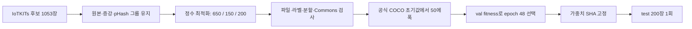

# 현재 설정과 실행 알고리즘

| 항목 | 실제 설정 |
|---|---|
| 학습 대상 | YOLO11s, 8개 보드 종류의 bbox |
| 초기화 | 공식 COCO yolo11s.pt, 이전 파일럿에서 이어 학습하지 않음 |
| 입력/배치/정밀도 | 640×640 / 8 / FP32, amp=false |
| 에폭/조기 종료 | 최대 50, 실제 50 / patience 12 |
| 선택 모델 | 검증 fitness 기준 epoch 48; test 선택 금지 |
| 최적화 | AdamW, lr0=0.001, lrf=0.05, cosine, weight_decay=0.0005 |
| warmup/누적 기준 | warmup 3 epochs / nbs=64; 실제 optimizer 갱신 557회 |
| 손실 계수 | box 7.5 / cls 0.5 / DFL 1.5 |
| 증강 | HSV 0.015/0.4/0.3, ±10° 회전, translate 0.1, scale 0.5, 좌우반전 0.5, mosaic 1.0 |
| 증강 종료 | 마지막 예정 10에폭 mosaic 종료; mixup/cutmix 0 |
| 재현 설정 | seed 20260929, deterministic=true, workers 2, torch threads 4 |
| GPU/런타임 | RTX 5060 Laptop 8GB, driver 610.88, Python 3.11.9, Torch 2.12.1+cu130, Ultralytics 8.4.120 |
| test 추론 | 640, batch 1, FP32, confidence 0.001, IoU 0.7, max_det 300, split=test |
| 일반 사진 추론 예시 | confidence 0.25; 최적화된 운영 임계값은 아님 |

[train.json](configs/train.json)은 원래 실행 코드에 명시한 설정이고 [effective_args.yaml](configs/effective_args.yaml)은 라이브러리 기본값까지 포함한 실제 설정입니다. [test.json](configs/test.json)은 별도 test 호출의 설정입니다. detection에 사용되지 않는 segmentation/export 기본값도 effective_args에는 그대로 남아 있습니다.

학습 중 손실과 파라미터의 유한성을 확인했습니다. optimizer post-step hook으로 실제 갱신을 세었고, 실제 results.csv 행을 기준으로 에폭을 집계했습니다. 최초 3에폭 점검을 통과한 뒤 같은 실행을 50에폭까지 진행했습니다. test 전 모델 SHA와 데이터 fingerprint를 확인하고 배타적인 test 시도 마커를 남겼습니다.

`code/`는 실제 사용한 로컬 코드의 원본 스냅샷으로 당시 절대경로가 들어 있습니다. `scripts/`는 이 보관 작업에서 추가한 경로 독립 복원 도우미입니다. 새 학습 도우미는 원본 설정을 읽지만 관측용 callback과 자동 test를 복제하지 않으며, 기존 실행의 증거를 대체하지 않습니다.
