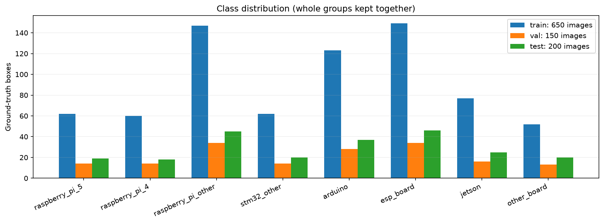

# 데이터와 분할

IoTKITs의 기존 선별 후보 1,053장 중 1,000장을 사용했습니다. 이미지 자체는 변경하지 않고 기존 bbox를 8클래스 YOLO 형식으로 변환했습니다. [클래스 ID 순서](configs/classes.json), [원래 매핑](evidence/class_map.json), [이미지별 경로·해시·그룹·이전 분할](evidence/dataset_index.json)을 보존했습니다.

| 분할 | 이미지 | bbox |
|---|---:|---:|
| train | 650 | 732 |
| val | 150 | 167 |
| test | 200 | 230 |

원본 이름+원래 클래스 및 증강/회전·반전 pHash 연결 그룹 전체를 한 분할에 배정했습니다. SciPy MILP로 정확한 이미지 수와 클래스별 사진 비율을 맞췄고, train은 클래스마다 최소 3그룹, val/test는 최소 2그룹을 요구했습니다. 이전 test 106장은 전부 test에 남겼습니다. test 추가분은 이전 val 86장과 train 8장입니다. 배정에 예측/AP는 사용하지 않았습니다.

기존 Embedded Hardware 960장은 하나의 큰 유사 그룹으로 연결돼 이 1,000장 실험에서 제외했습니다. IoTKITs의 STM32는 블랙필 계열로 stm32_other에 매핑했고 stm32_nucleo는 제외했습니다. 포트 라벨은 이 모델의 목표가 아닙니다.

검증 당시 라벨/파일 오류와 설정된 기준의 split 간/Commons 유사 후보는 0건입니다. [원래 검증 결과](evidence/dataset_verification.json)와 [배정 근거](evidence/derivation.json)를 보존했습니다. [분할별 클래스 박스·그룹 수](split_class_counts.csv)도 확인할 수 있습니다. pHash 거리 기준은 데이터 index의 duplicate_distance=6이며 회전/반전 screening을 사용했습니다. 이는 실물 보드나 촬영 세션의 독립성을 증명하지 않습니다.

Release의 datasets/boards_v1에 정확한 1,000장과 라벨이 있습니다. 당시 data.yaml의 절대경로는 증거 보존을 위해 유지했습니다. 복원 도우미가 새 학습 출력 폴더에 현재 경로용 YAML을 별도로 만듭니다. Commons 원본 44장은 이 ZIP에 포함하지 않았으며 해시 목록과 당시 검사 결과만 보존했습니다. 따라서 복원 검증은 기존 데이터 바이트/분할을 확인하는 것이며 Commons 사진으로 유사도 검사를 새로 수행하지 않습니다.

