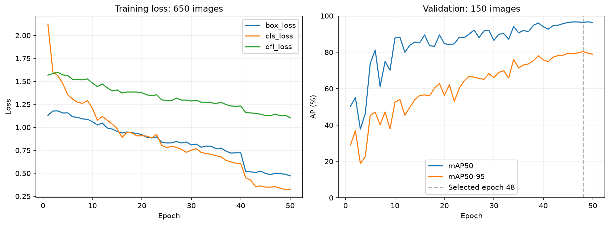
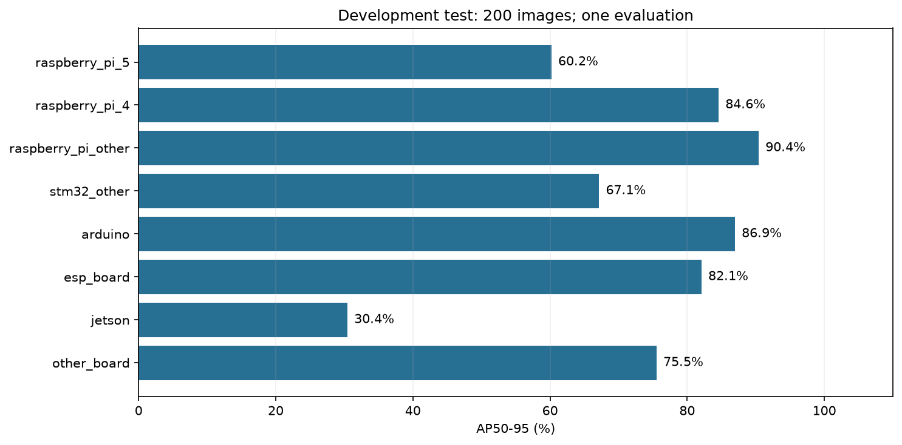

# 보드 검출 — 총 1,000장, 650 / 150 / 200 분할

**YOLO11s를 최대 50에폭 설정으로 실행해 실제 50에폭 학습했습니다. 검증 성능으로 epoch 48 모델을 선택한 뒤 개발용 test 200장을 한 번 평가했습니다. mAP50는 84.72%, mAP50–95는 72.16%입니다.**

## 데이터 분할

| 용도 | 이미지 | 정답 박스 | 역할 |
|---|---:|---:|---|
| train | 650 | 732 | 가중치 학습 |
| val | 150 | 167 | best 모델 선택과 조기 종료 |
| test | 200 | 230 | checkpoint 고정 후 이번 실험에서 1회 개발 평가 |
| 합계 | 1,000 | 1129 | 8개 보드 클래스 |

IoTKITs 후보 1,053장에서 1,000장을 골랐습니다. 클래스별 사진 수를 고려하면서 기존 원본·증강·유사도 연결 그룹 전체를 한 분할에만 배정했습니다. 반복 영상 960장이 큰 그룹으로 연결된 Embedded Hardware는 이 1,000장 실험에서 제외했습니다. 기존 9클래스·포트 데이터와 10에폭 가중치는 보존했습니다. Nucleo와 포트는 이번 모델 범위에 포함하지 않았습니다.

정확한 이미지 수와 클래스별 그룹 지원을 정수 최적화로 맞췄습니다. 배정에는 예측이나 AP 수치를 사용하지 않았습니다. 모든 클래스가 각 분할에 있고, train은 클래스마다 최소 3개, val/test는 최소 2개 연결 그룹을 포함합니다. 파일·라벨 오류와 설정된 회전·반전 pHash 기준 split/Commons 유사 후보는 0건입니다. 연결 그룹 수가 실제 실물·촬영 세션의 독립성을 입증하지는 않습니다.

**test 200장은 새 최종시험이 아닙니다.** 이전 test 106장, 이전 val 86장, 이전 train 8장으로 구성한 개발 평가입니다. 이전 test를 이번 train/val로 옮기지는 않았습니다. 이번 모델은 공식 초기 가중치에서 다시 시작했고, 새 test 200장은 이번 모델의 학습·checkpoint 선택에는 사용하지 않았습니다. 이전 10에폭 실험과 데이터·분할이 달라 점수 차이를 에폭 증가만의 효과로 해석할 수 없습니다.


## 학습 설정과 실제 실행

| 항목 | 값 |
|---|---|
| 모델 | YOLO11s, 8클래스 bbox 검출 |
| 초기화 | 공식 COCO 가중치; 이전 10에폭 모델에서 이어 학습하지 않음 |
| 실행 GPU | NVIDIA GeForce RTX 5060 Laptop GPU |
| 에폭 | 최대 50 / 실제 50 |
| 조기 종료 | 검증 fitness가 12에폭 동안 개선되지 않을 때 |
| optimizer 갱신 | 실제 557회 |
| 입력·배치 | 640 × 640 / batch 8 / FP32 |
| 최적화 | AdamW, 초기 lr 0.001, cosine schedule, warmup 3 epochs |
| 증강 | mosaic 포함, 마지막 예정 10에폭은 mosaic 종료 |
| seed | 20260929 |
| 학습 시간 | 17.8분 |
| 최대 PyTorch 할당 메모리 | 3.51 GiB |
| 선택 epoch | 48, 검증 fitness 기준 |
| 이번 실행의 10에폭 시점 val mAP50–95 | 52.55% |
| val mAP50 / mAP50–95 | 96.44% / 80.41% |
| 개발 test mAP50 / mAP50–95 | 84.72% / 72.16% |



10에폭 시점 수치는 이번 50에폭 설정 실행의 중간 기록입니다. 이전의 별도 10에폭 파일럿과 비교한 수치가 아니며, 독립적인 하이퍼파라미터 대조 실험도 아닙니다.

## 클래스별 개발 평가

| 클래스 | test 박스 | test 연결 그룹 | AP50 | AP50–95 |
|---|---:|---:|---:|---:|
| raspberry_pi_5 | 19 | 11 | 66.83% | 60.18% |
| raspberry_pi_4 | 18 | 10 | 93.15% | 84.57% |
| raspberry_pi_other | 45 | 33 | 99.28% | 90.41% |
| stm32_other | 20 | 13 | 75.20% | 67.14% |
| arduino | 37 | 35 | 99.03% | 86.95% |
| esp_board | 46 | 36 | 89.29% | 82.07% |
| jetson | 25 | 5 | 55.47% | 30.44% |
| other_board | 20 | 2 | 99.50% | 75.52% |



test 사진이 200장이어도 클래스당 독립 그룹이 적은 경우 불확실성이 큽니다. 실제 D455 촬영 성능과 다양한 조명·배경·보드 개체에서의 일반화는 별도 검증이 필요합니다. 이번 결과로 운영 임계값을 결정하거나 새 최종시험 성능이라고 주장하지 않습니다.

## 결과 파일

- [선택된 가중치](https://github.com/hkjung1011/pcb-d455-component-vision/releases/download/boards1000-2026-09-30/boards8-1000images-yolo11s-best.pt), SHA-256 `25a6253ce7520d50d362fdb276e61d25b2f77ec78583d8706cd463f74282b766`
- [학습 기록](evidence/training-summary.json) · [test 결과](evidence/test-evaluation.json)
- [분할 검증](evidence/dataset_verification.json) · [분할·그룹 근거](evidence/derivation.json)
- [클래스별 표](test_per_class.csv) · [분할별 라벨·그룹 수](split_class_counts.csv)
- [학습 코드](code/run_boards1000.py) · [분할 코드](code/prepare_boards1000.py)

```python
from ultralytics import YOLO
model = YOLO("boards8-1000images-yolo11s-best.pt")
model.predict(source="board_photo.jpg", imgsz=640, conf=0.25, save=True)
```

conf 0.25는 실행 예시이며 test로 최적화한 임계값이 아닙니다. 이번 GitHub Release에는 정확한 1,000장과 YOLO 라벨을 추가했습니다. 원 배포 ZIP 전체는 기존 로컬 작업 폴더에 있습니다. code/는 당시 로컬 경로를 보존하며, 다른 PC에서는 [복원 안내](REPRODUCE.md)의 scripts/ 도우미를 사용합니다.
