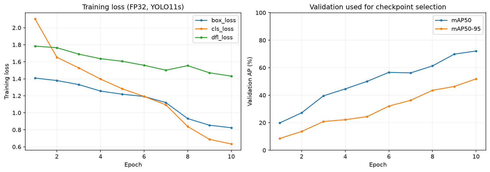
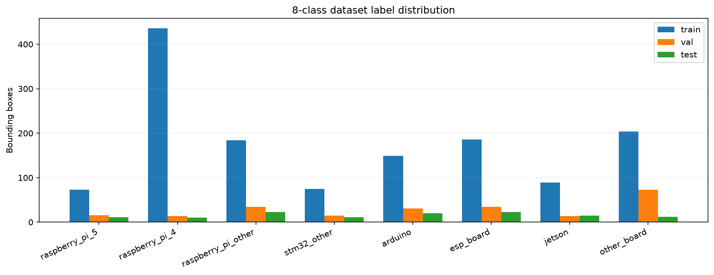
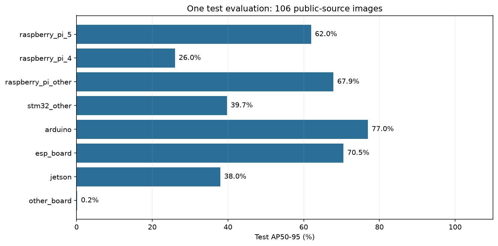

# 8클래스 보드 검출 파일럿 — 2026-09-29

**YOLO11s를 실제 10에폭 학습하고, 검증 성능으로 선택한 가중치를 고정한 뒤 test 106장으로 한 번 평가했습니다. test mAP50는 61.81%, mAP50–95는 47.65%입니다.**

이 모델은 Nucleo를 제외한 8클래스 보드 검출입니다. Nucleo의 검증·평가 자료가 없어 별도 8클래스 데이터셋을 만들었고, 기존 9클래스 자료·포트 자료·기존 모델은 보존했습니다. 포트 학습은 실행하지 않았습니다.

## 실제 실행

| 항목 | 결과 |
|---|---|
| 모델 | YOLO11s, 공식 COCO 초기 가중치 |
| GPU | NVIDIA GeForce RTX 5060 Laptop GPU |
| 학습 | 10에폭, optimizer 실제 갱신 235회 |
| 설정 | 입력 640, batch 8, FP32, AdamW lr 0.001, seed 20260929 |
| 학습 시간 | 5.8분 |
| PyTorch 최대 할당 메모리 | 3.51 GiB |
| 데이터 이미지 | train 1,308 / val 206 / test 106 |
| Nucleo 제외 | Nucleo가 포함된 train 이미지 393장 전체 제외 |
| 선택 epoch | 기록된 val fitness 기준 10 |
| 검증 mAP50 / mAP50–95 | 72.16% / 51.93% |
| test mAP50 / mAP50–95 | 61.81% / 47.65% |
| test 실행 횟수 | 가중치 해시 고정 후 1회 |

3에폭 시점에 손실과 모델 값의 유한성, 실제 optimizer 갱신을 확인하고 총 10에폭까지 진행했습니다. 초기 첫 시도는 상태 점검 코드와 라이브러리 손실값 형식 차이로 optimizer 갱신 0회에서 중단됐습니다. 점검 코드를 수정한 뒤 동일 초기 가중치로 다시 시작했으며 실패 기록도 보존했습니다.

학습 종료 후 라이브러리가 마지막 검증 callback을 한 번 더 호출해 임시 로그에 epoch 11이 생겼습니다. 실제 `results.csv`의 10개 학습 행과 동일 optimizer 갱신 수를 근거로 완료 에폭 집계만 정정했습니다. 원래 기록과 [정정 근거](evidence/epoch-accounting-correction.json)를 보존했으며, 가중치·test 지표는 그대로이고 test를 반복하지 않았습니다. 동봉 실행 코드에는 이후의 기록 오류를 막는 수정도 포함했습니다.

## 학습 곡선과 데이터 분포





## 클래스별 test AP

| 클래스 | test 정답 박스 | AP50 | AP50–95 |
|---|---:|---:|---:|
| raspberry_pi_5 | 11 | 76.50% | 61.98% |
| raspberry_pi_4 | 10 | 34.56% | 26.00% |
| raspberry_pi_other | 23 | 84.91% | 67.86% |
| stm32_other | 11 | 55.12% | 39.72% |
| arduino | 20 | 93.92% | 76.97% |
| esp_board | 23 | 86.57% | 70.51% |
| jetson | 15 | 62.37% | 37.99% |
| other_board | 12 | 0.53% | 0.16% |



이번 결과에서 `other_board` AP50–95는 0.16%, Pi4는 26.00%로 낮습니다. 특히 기타 보드 클래스는 학습 자료가 Embedded Hardware의 AURIX에 집중되어 있어 다양한 보드로 일반화되는지 보완 검토가 필요합니다. 이 파일럿 점수만으로 모든 보드에 사용할 준비가 끝났다고 판단하지 않습니다.

## 사용 범위

공개자료의 그룹 분할에서 얻은 파일럿 결과입니다. Nucleo·포트 인식 성능, 실제 D455 카메라 정확도, 실물 보드·촬영 세션의 통계적 독립성을 입증하지 않습니다. 각 클래스의 평가 사진과 그룹 수가 작으므로 여러 촬영 환경으로 일반화되는지 추가 확인해야 합니다. test 점수로 재학습 설정을 선택하지 않았습니다.

파이프라인: 기존 분할 유지 → Nucleo 포함 이미지 전체 제외 → 8개 클래스 ID 재매핑 → 파일·라벨·그룹·holdout 재검증 → 10에폭 학습 → val fitness로 checkpoint 선택 → SHA-256 고정 → test 1회.

가중치: [boards8-yolo11s-best.pt](https://github.com/hkjung1011/pcb-d455-component-vision/releases/tag/boards1000-2026-09-30)

SHA-256: `e04e249bcf9805088dca1de641a1e213d6af6f7403b8559ab748e2c047969a5c`

```python
from ultralytics import YOLO
model = YOLO("boards8-yolo11s-best.pt")
model.predict(source="board_photo.jpg", imgsz=640, conf=0.25, save=True)
```

위 conf 0.25는 예시이며 test에서 최적화한 운영 임계값이 아닙니다. 클래스 이름은 가중치에 포함되어 있습니다. 원본 사진·ZIP은 기존 로컬 데이터 폴더에 있고 이 결과 묶음에는 포함하지 않았습니다.

[학습 기록](evidence/training-summary.json) · [test 결과](evidence/test-evaluation.json) · [데이터 검증](evidence/dataset_verification.json) · [클래스별 CSV](test_per_class.csv) · [소스 코드](code/run_boards8_pilot.py)


GitHub에서는 가중치를 Release ZIP의 `history/pilot10/boards8-yolo11s-best.pt`에서 복원합니다. 이 폴더의 ARTIFACT_MANIFEST.json은 원래 로컬 결과 묶음의 해시 기록입니다. GitHub용 링크 안내를 추가한 README의 현재 해시는 상위 BUNDLE_MANIFEST.json에 있습니다.
