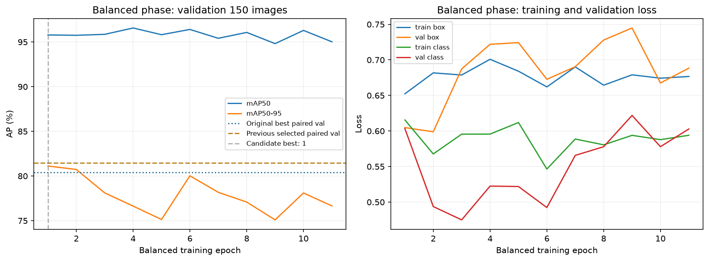
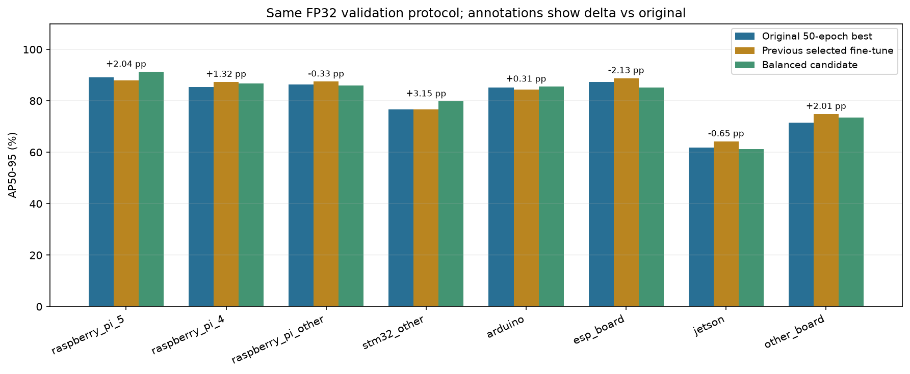
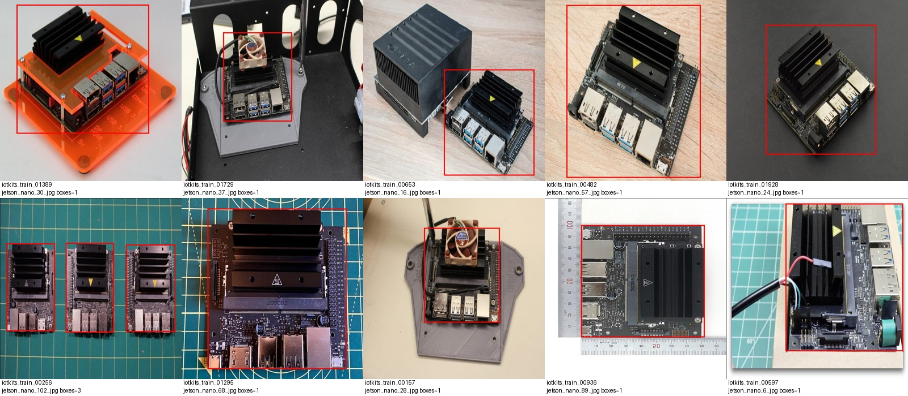
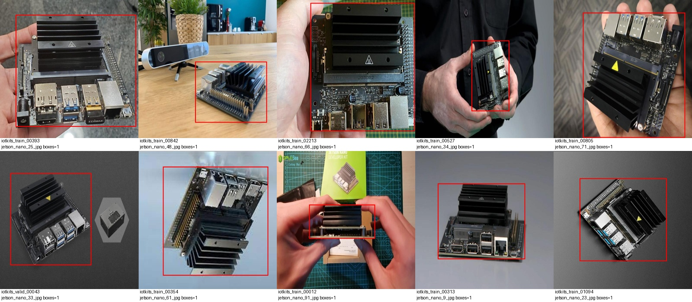
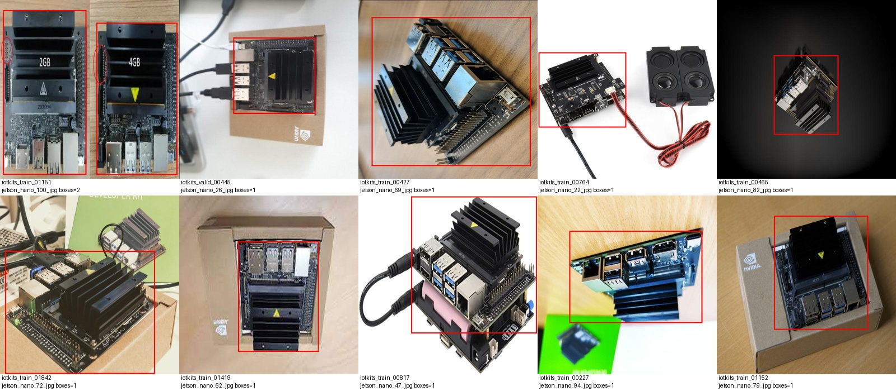
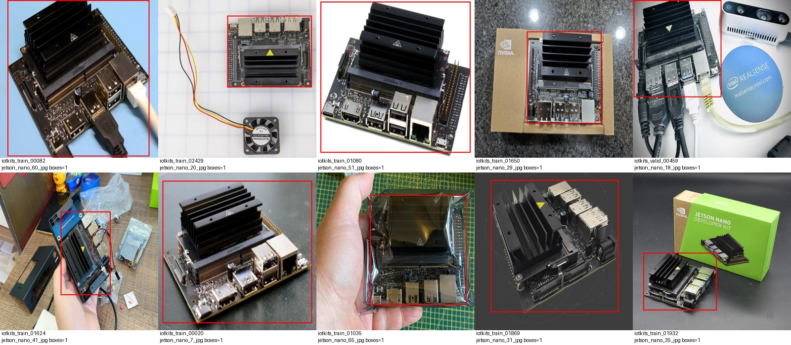

# 보드 검출 — Jetson 학습 데이터 균형 보정

**총 1,000장과 train 650 / val 150 / test 200 분할을 유지하고, 학습셋의 반복 TX2 사진 40장을 검수한 Nano 사진 40장으로 교체했습니다. 원래 50에폭 실험의 48에폭 best에서 실제 11에폭 학습했습니다. 검증의 사전 승격 기준을 모두 통과하지 못해 이전 미세 조정 모델을 유지했습니다. 이번 균형 보정 후보의 test는 실행하지 않았습니다.**

## 변경한 데이터와 비교 범위

Jetson 학습 사진은 TX2 27장 + Nano 40장 = 67장, 정답 박스 74개입니다. 원래 학습셋은 TX2 67장·77박스와 3개 연결 그룹에 한정돼 Nano 학습 사진이 없었습니다. Nano 후보는 기존 train/val/test 및 Commons holdout과 pHash로 검사하고 원본 파일명 계열을 고려했으며, 라벨이 불완전한 장면을 제외한 뒤 최종 정답 박스 사진을 검토했습니다. 후보의 실제 보드 개체·촬영 장면 독립성까지 확인한 것은 아닙니다.

**val/test 350장의 ID, 이미지 바이트와 라벨 바이트는 원래 데이터와 동일합니다.** 다른 클래스와 8개 클래스 순서를 유지했습니다. Nucleo와 포트는 이번 모델 범위에 포함하지 않았습니다. 이번 단계는 새 데이터·optimizer·학습률 일정·mosaic를 적용했으므로 데이터 교체나 에폭 증가 한 가지의 효과를 분리한 실험이 아닙니다.

## 학습 단계·설정

| 항목 | 값 |
|---|---|
| 전체 / 분할 | 1,000장 / train 650 · val 150 · test 200 |
| 원래 학습 | 실제 50에폭, 선택 best epoch 48 |
| 이전 미세 조정 | 실제 13에폭, best epoch 5; 별도 이력으로 보존 |
| 이번 초기값 | 원래 50에폭 best, 이전 미세 조정에서 이어 학습하지 않음 |
| 이번 단계 | 최대 30 / 실제 11에폭; 후보 best epoch 1 |
| 입력 / 배치 / 계산 | 640 × 640 / 8 / FP32 |
| 최적화 | 새 AdamW, lr 0.0003, cosine, lrf 0.1 |
| Warmup | 3에폭, bias lr 0 |
| 증강 | mosaic 0.5, epoch 21 시작 시 종료 예정; 회전 10°, scale 0.5, translate 0.1, HSV·좌우 반전 유지 |
| 조기 종료 / seed | patience 10 / 20260929 |
| 실제 optimizer 갱신 | 157회 |
| 학습 시간 / 최대 할당 메모리 | 4.6분 / 3.51 GiB |
| 환경 | NVIDIA GeForce RTX 5060 Laptop GPU; PyTorch 2.12.1+cu130; Ultralytics 8.4.120 |

예정된 mosaic 종료는 이번 단계 epoch 21 시작 시점입니다. 실제 11에폭에서 조기 종료해 **mosaic를 끈 마무리 단계에 도달하지 못했습니다.**



## 같은 검증 조건에서의 선택

프로토콜은 val 150장, FP32, `imgsz=640`, `batch=8`, `conf=0.001`, `iou=0.7`, `max_det=300`, GPU 0입니다. 검증 사진·라벨 바이트와 평가 프로토콜이 같음을 확인해 원래 best와 이전 미세 조정 모델의 기존 standalone validation JSON을 재사용했습니다. baseline 재추론은 하지 않았습니다. 후보는 같은 조건으로 평가했습니다.

학습 전에 네 가지 승격 기준을 고정했습니다. 원래 best는 초기값 및 개선 비교 기준이며, 이전 미세 조정 선택 모델은 전체 AP 하락 방지 기준과 승격 실패 시 유지하는 모델입니다. 모든 선택 기준은 validation만 사용합니다.

| 지표 | 원래 50에폭 best | 이전 선택 모델 | 이번 균형 보정 후보 |
|---|---:|---:|---:|
| val mAP50 | 96.44% | 97.01% | 95.79% |
| val mAP50–95 | 80.41% | 81.46% | 81.12% |

| 사전 승격 기준 | 판정 | 관측값 |
|---|---|---:|
| 전체 AP: 원래 best보다 +0.5%p 이상 | 통과 | +0.71%p |
| 모든 클래스: 원래 best보다 하락 5%p 이하 | 통과 | 최악 -2.13%p |
| Jetson AP: 원래 best 이상 | 미통과 | -0.65%p |
| 전체 AP: 이전 선택 모델 이상 | 미통과 | -0.34%p |

| 클래스 | val 정답 박스 | 원래 AP50–95 | 이전 선택 AP50–95 | 이번 후보 AP50–95 | 원래 대비 |
|---|---:|---:|---:|---:|---:|
| raspberry_pi_5 | 14 | 89.21% | 88.04% | 91.25% | +2.04%p |
| raspberry_pi_4 | 14 | 85.36% | 87.34% | 86.68% | +1.32%p |
| raspberry_pi_other | 34 | 86.31% | 87.45% | 85.97% | -0.33%p |
| stm32_other | 14 | 76.58% | 76.57% | 79.73% | +3.15%p |
| arduino | 28 | 85.16% | 84.47% | 85.47% | +0.31%p |
| esp_board | 34 | 87.30% | 88.77% | 85.17% | -2.13%p |
| jetson | 16 | 61.88% | 64.23% | 61.23% | -0.65%p |
| other_board | 13 | 71.46% | 74.86% | 73.47% | +2.01%p |



승격 기준은 작은 재사용 val에 적용한 실무 규칙이며 통계적 유의성을 뜻하지 않습니다. Jetson val은 TX2 14장 + Nano 2장, 2개 연결 그룹뿐입니다. 재사용 검증셋에 반복 적응할 가능성이 있어, 향후 새 보드·배경·조명으로 고정한 독립 평가가 필요합니다. D455 실촬영 성능은 아직 검증하지 않았습니다.

## Test 기록

균형 보정 후보의 새 test 실행: **0회**. 아래 두 점수는 각 이전 모델의 역사적 평가이며 이번 후보의 성능이 아닙니다.

| 이전 모델의 역사적 개발 평가 | mAP50 | mAP50–95 | Jetson AP50–95 | 기록 |
|---|---:|---:|---:|---|
| 원래 50에폭 best | 84.72% | 72.16% | 30.44% | 이전 실행 1회 |
| 이전 미세 조정 선택 모델 | 84.05% | 72.43% | 19.94% | 이전 실행 1회 |

이전 미세 조정 모델은 전체 개발 test mAP50–95가 소폭 높지만, Jetson AP50–95는 원래 모델의 30.44%에서 19.94%로 10.50%p 낮아졌습니다. 이 한계를 공개해 보존하며, 현재 모델 유지 결정은 사전에 정한 validation 승격 규칙을 따른 것입니다.

[원래 test 기록](evidence/original50/test-evaluation.json) · [이전 미세 조정 test 기록](evidence/previous_finetune/test-evaluation.json). test 200장은 이전 test 106장·이전 val 86장·이전 train 8장에서 만든 재사용 개발 평가셋입니다. 새 최종시험이 아니며, test 점수는 이번 후보의 승격 여부에 사용하지 않았습니다.

## 파일과 복원 근거

- [현재 선택 모델](https://github.com/hkjung1011/pcb-d455-component-vision/releases/download/boards1000-balanced-jetson-2026-09-30/selected-best.pt): `fa0b8fb5fc11de748e9d8051b93fc57dde5c6cc34db6167045e3fee9e4912752`
- [이번 후보 best](https://github.com/hkjung1011/pcb-d455-component-vision/releases/download/boards1000-balanced-jetson-2026-09-30/candidate-best.pt) · [이번 후보 last](https://github.com/hkjung1011/pcb-d455-component-vision/releases/tag/boards1000-balanced-jetson-2026-09-30)
- [원래 초기값·비교 baseline](https://github.com/hkjung1011/pcb-d455-component-vision/releases/tag/boards1000-balanced-jetson-2026-09-30): `25a6253ce7520d50d362fdb276e61d25b2f77ec78583d8706cd463f74282b766`
- [이전 선택 모델](https://github.com/hkjung1011/pcb-d455-component-vision/releases/tag/boards1000-balanced-jetson-2026-09-30): `fa0b8fb5fc11de748e9d8051b93fc57dde5c6cc34db6167045e3fee9e4912752`
- [설정과 사전 승격 정책](evidence/experiment_plan.json) · [승격 결정](evidence/selection.json)
- [실제 실행 기록](evidence/training-summary.json) · [epoch CSV](evidence/results.csv) · [적용 설정](evidence/args.yaml)
- [기존 baseline 검증](evidence/baseline_validation.json) · [이전 선택 검증](evidence/current_selected_validation.json) · [후보 검증](evidence/candidate_validation.json)
- [클래스 비교 CSV](validation_three_experiment_comparison.csv) · [분할 라벨 수](split_class_counts.csv)
- [데이터 검증](evidence/dataset/verification.json) · [교체 검증](evidence/dataset/data_correction_verification.json) · [라벨·사진 검토](evidence/dataset/visual_review.json)
- [새 데이터 인덱스](evidence/dataset/dataset_index.json) · [분할·교체 근거](evidence/dataset/derivation.json) · [원본 라벨](evidence/dataset/source_annotations.json)
- [학습 코드](code/run_boards1000_balanced_jetson.py) · [데이터 준비 코드](code/prepare_boards1000_balanced_jetson.py)
- [기계 판독 요약](PACKAGE_SUMMARY.json) · [패키지 SHA-256 목록](evidence/original_local_artifact_manifest.json)
- [결과·선택 규칙 감사](evidence/outcome_audit.json)

새 데이터 fingerprint: `3120af5994f7494f608b31b59b48833eebee8423408f5a0190f516f6e708ba6f`. 모델 파일은 SHA-256으로 연결해 기록했습니다. 패키지에는 데이터 원본을 중복 복사하지 않았고 기존 학습 폴더에 정확한 1,000장과 라벨이 있습니다. 코드와 data.yaml에는 로컬 경로가 있으므로 다른 PC에서는 복원한 경로로 조정해야 합니다. 이전 아카이브 환경 기록은 `evidence/baseline_environment`이며, 이번 라이브 버전은 실행 상태 JSON에 기록했습니다.

```python
from ultralytics import YOLO
model = YOLO("selected-best.pt")
model.predict(source="board_photo.jpg", imgsz=640, conf=0.25, save=True)
```

`conf=0.25`는 예시이며 test로 최적화한 운영 임계값이 아닙니다.

## 최종 Nano 라벨 검토 사진





