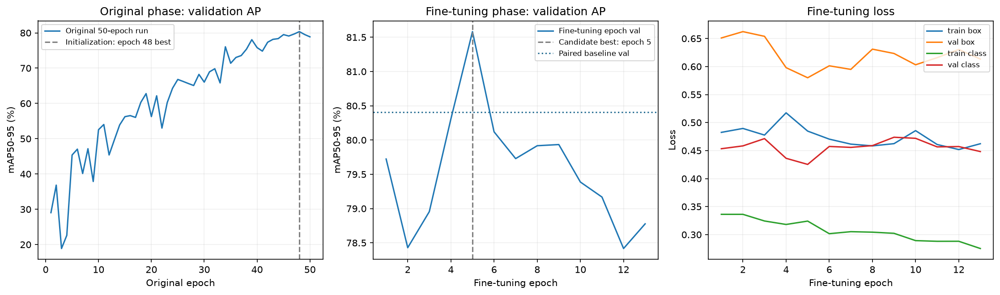
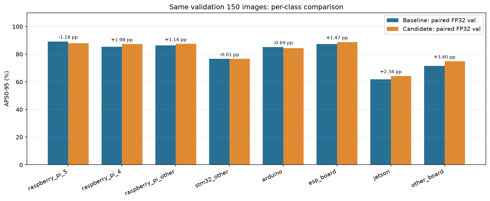
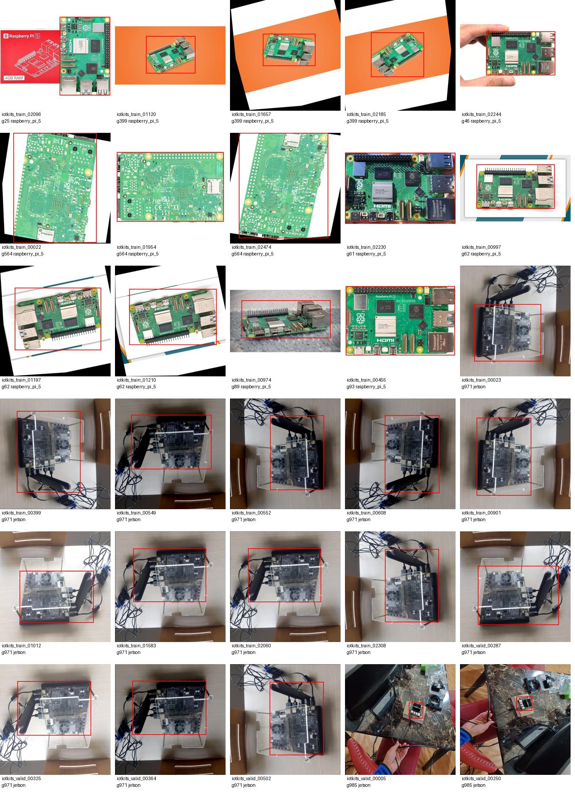
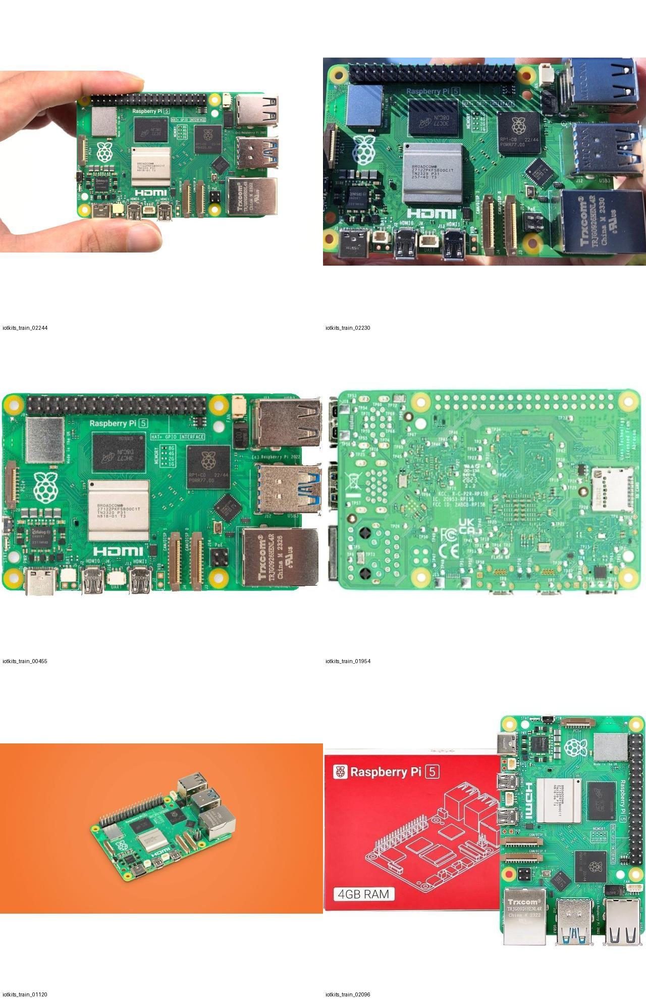

# 보드 모델 — 50에폭 학습 후 최대 20에폭 미세 조정

**원래 50에폭 실험의 48에폭 best 가중치에서 새 optimizer로 실제 13에폭 미세 조정했습니다. 검증 승격 기준을 통과해 미세 조정 모델을 선택했습니다. 선택 후 개발용 test 200장을 이번 단계에서 1회 평가했고, mAP50 84.05%, mAP50–95 72.43%를 기록했습니다.**

## 데이터와 비교 조건

| 항목 | 값 |
|---|---|
| 총 데이터 / 분할 | 1,000장 / train 650 · val 150 · test 200 |
| 학습 클래스 | Raspberry Pi 5/4/other, STM32 other, Arduino, ESP, Jetson, other board — 8개 |
| 데이터 변경 | 없음; 기존 분할·원본/유사도 그룹·라벨·클래스 순서 유지 |
| 기존 학습 | 실제 50에폭, 검증으로 선택한 best는 epoch 48 |
| 미세 조정 | 최대 20 / 실제 13에폭; 후보 best는 이 단계의 epoch 5 |
| 비교 대상 | 기존 best와 새 후보 best를 같은 standalone FP32 val 조건으로 재평가 |
| 비교 역할 | val 150장만 모델 선택에 사용; test는 승격한 뒤에만 조건부 실행 |

Nucleo와 포트는 이번 모델에 포함하지 않았습니다. test 200장은 이전 test 106장, 이전 val 86장, 이전 train 8장을 묶은 개발용 평가셋입니다. 현재 train/val/test에서 같은 연결 그룹은 한 분할에만 있습니다. 연결 그룹이 실제 보드 개체·촬영 세션의 독립성을 입증하지는 않습니다.

## 변경한 설정과 실제 실행

| 항목 | 설정 / 기록 |
|---|---|
| 초기 가중치 | 기존 48에폭 best; `resume=False`, 새 AdamW optimizer |
| 입력 / 배치 / 계산 | 640 × 640 / 8 / FP32 (`amp=False`) |
| 미세 조정 학습률 | `lr0=0.0001`, cosine decay, `lrf=0.1` |
| Warmup | 1에폭, `warmup_bias_lr=0` |
| Mosaic | 0; 원래 학습의 마지막 mosaic 종료 단계에서 이어지는 설정 |
| 기타 증강 | 회전 10°, scale 0.5, translate 0.1, 좌우 반전 0.5, HSV 유지 |
| 조기 종료 | 검증 fitness가 8에폭 동안 개선되지 않을 때 |
| Seed | 20260929 |
| 실제 optimizer 갱신 | 148회 |
| 미세 조정 시간 | 5.1분 |
| 실행 환경 | NVIDIA GeForce RTX 5060 Laptop GPU; PyTorch 2.12.1+cu130; Ultralytics 8.4.120 |
| 최대 PyTorch 할당 메모리 | 3.54 GiB |

원래 50에폭 실행과 추가 미세 조정 단계를 구분해 기록했습니다. 새 optimizer·학습률 일정과 mosaic 설정이 적용돼 에폭 증가만의 효과를 분리한 실험이 아닙니다. 같은 val을 반복 사용한 개발 과정이므로 개선 수치를 새 데이터 일반화의 확정 증거로 해석하지 않습니다.



곡선은 각 학습 단계의 epoch별 validation 기록입니다. 모델 승격은 아래의 **동일한 standalone 평가 조건으로 얻은 두 모델의 결과**를 사용했습니다. 두 단계의 epoch 축을 분리했으며, 미세 조정 초기값은 원래 best epoch 48입니다.

## 동일한 검증 조건의 비교와 승격 결정

검증 조건: `split=val`, `imgsz=640`, `batch=8`, `conf=0.001`, `iou=0.7`, `max_det=300`, `half=False`, GPU 0. 선택 전에 고정한 기준은 **전체 mAP50–95가 최소 +0.5%p 개선**되고 **어느 클래스도 AP50–95가 5%p 넘게 하락하지 않는 것**입니다. 소규모 검증셋에 적용한 실무 기준이며 통계적 유의성을 의미하지 않습니다.

| 지표 | 기존 best | 미세 조정 후보 | 차이 |
|---|---:|---:|---:|
| val mAP50 | 96.44% | 97.01% | +0.58%p |
| val mAP50–95 | 80.41% | 81.46% | +1.06%p |
| 최악의 클래스 AP50–95 차이 | — | — | -1.18%p |
| 후보 승격 | — | 통과 | 전체·클래스 기준을 함께 적용 |

| 클래스 | val 정답 박스 | val 연결 그룹 | 기존 AP50–95 | 후보 AP50–95 | 차이 |
|---|---:|---:|---:|---:|---:|
| raspberry_pi_5 | 14 | 8 | 89.21% | 88.04% | -1.18%p |
| raspberry_pi_4 | 14 | 7 | 85.36% | 87.34% | +1.98%p |
| raspberry_pi_other | 34 | 19 | 86.31% | 87.45% | +1.14%p |
| stm32_other | 14 | 4 | 76.58% | 76.57% | -0.01%p |
| arduino | 28 | 18 | 85.16% | 84.47% | -0.69%p |
| esp_board | 34 | 13 | 87.30% | 88.77% | +1.47%p |
| jetson | 16 | 2 | 61.88% | 64.23% | +2.34%p |
| other_board | 13 | 2 | 71.46% | 74.86% | +3.40%p |



Jetson 학습 데이터는 67장·77박스, TX2 계열 3개 연결 그룹에 한정되고 Nano 그룹이 없습니다. val Jetson도 2개 그룹, TX2 14장과 Nano 2장뿐입니다. 초기 자료 선택이 이미지 수 할당량에서 멈추면서 큰 TX2 증강 묶음이 Jetson 할당량을 많이 차지했고, 선택된 Nano 원본 파일명 계열 5개는 모두 val/test로 배정됐습니다. 에폭을 늘려도 빠진 보드 종류·배경·촬영 조건이 추가되지는 않습니다.

읽기 전용 조사에서 현재 데이터에 쓰이지 않은 Nano 후보 90장·58개 원본 파일명 계열을 찾았습니다. 현재 1,000장 및 Commons 44장과 설정된 pHash 임계값(분할 6 / holdout 8)으로 비교하고 후보끼리 연결을 합쳐 57개 후보 연결 그룹을 기록했으며, 원자료 SHA-256도 대조했습니다. 이 후보는 이번 모델에 사용하지 않았고 실제 보드·촬영 장면 독립성과 라벨 적합성은 아직 확인되지 않았습니다. 다음 데이터 버전은 후보의 사진·라벨을 검수한 뒤 Nano 학습용 원본 계열을 먼저 확보하고 TX2/Nano 하위 종류별 균형을 맞춰야 합니다. [자료 검토](evidence/data_review.json)와 [Nano 후보 인벤토리](data_review/nano_candidate_inventory.json)에 근거를 보존했습니다. D455 실촬영 성능은 아직 검증하지 않았습니다.

## Test 기록의 범위

**새 후보 모델의 개발용 test 결과**입니다. 이번 단계에서 승격 이후 1회 평가했습니다. 이전 평가에 이미 사용한 200장이므로 독립적인 최종시험 성능으로 해석할 수 없습니다.

| 기록 | mAP50 | mAP50–95 | 이번 단계 test 실행 |
|---|---:|---:|---:|
| 승격한 후보의 새 개발 평가 | 84.05% | 72.43% | 1회 |

[후보 test 기록](evidence/test-evaluation.json) · [1회 실행 표식](evidence/test-evaluation-attempt.json)

## 가중치·설정·근거 파일

- [현재 선택 모델](https://github.com/hkjung1011/pcb-d455-component-vision/releases/download/boards1000-finetune-2026-09-30/selected-best.pt): SHA-256 `fa0b8fb5fc11de748e9d8051b93fc57dde5c6cc34db6167045e3fee9e4912752`
- [미세 조정 후보 best](https://github.com/hkjung1011/pcb-d455-component-vision/releases/download/boards1000-finetune-2026-09-30/candidate-best.pt): SHA-256 `fa0b8fb5fc11de748e9d8051b93fc57dde5c6cc34db6167045e3fee9e4912752`
- [원래 baseline best](https://github.com/hkjung1011/pcb-d455-component-vision/releases/download/boards1000-finetune-2026-09-30/baseline-best.pt): SHA-256 `25a6253ce7520d50d362fdb276e61d25b2f77ec78583d8706cd463f74282b766`
- [승격 결정 원자료](evidence/selection.json) · [설정과 사전 기준](evidence/experiment_plan.json)
- [baseline 동일 조건 검증](evidence/baseline_validation.json) · [candidate 동일 조건 검증](evidence/candidate_validation.json)
- [미세 조정 실행 기록](evidence/training-summary.json) · [실제 epoch CSV](evidence/results.csv) · [적용 설정](evidence/args.yaml)
- [클래스별 검증 비교 CSV](validation_per_class_comparison.csv) · [분할별 라벨·그룹 수](split_class_counts.csv)
- [데이터 검증](evidence/dataset/verification.json) · [이미지·라벨 인덱스](evidence/dataset/dataset_index.json) · [분할 근거](evidence/dataset/derivation.json)
- [학습 코드](code/run_boards1000_finetune.py) · [보고서 생성 코드](code/package_boards1000_finetune.py)
- [기계 판독 요약](PACKAGE_SUMMARY.json) · [패키지 파일 SHA-256](evidence/original_local_artifact_manifest.json)

데이터 fingerprint: `66284009264318497a8ba16e8d532fc7f7bc0c6c96bdf1d4eae1c3d3525f5922`. 이미지 원본은 기존 1,000장 데이터셋과 GitHub 복원 ZIP을 유지하며 이 보고서 패키지에는 중복 복사하지 않았습니다. 코드의 로컬 경로는 다른 PC에서 복원한 경로에 맞춰 조정해야 합니다. `evidence/baseline_environment`는 이전 아카이브의 환경 기록이며, 이번 실행의 라이브 버전은 위 실행 기록과 `execution_state.json`에 있습니다.

```python
from ultralytics import YOLO
model = YOLO("selected-best.pt")
model.predict(source="board_photo.jpg", imgsz=640, conf=0.25, save=True)
```

`conf=0.25`는 실행 예시이며 test로 최적화한 운영 임계값이 아닙니다.

## 검증 데이터 확인 자료

아래 자료는 기존 val 사진과 정답 박스의 육안 확인용이며, 파일명은 확인 당시의 작업명입니다.



