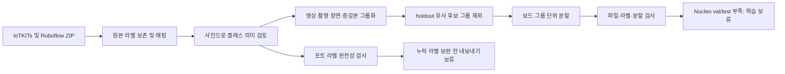

# 보드 종류·포트 데이터 준비 — 2026-09-29

**보드·포트 후속 모델을 위한 데이터 준비 기록입니다. 이번 작업에서 학습과 test 평가는 실행하지 않았고, 두 모델 모두 아직 학습 준비가 완료되지 않았습니다.** 기존 D455 시험 모델과는 별도 작업입니다.

| 항목 | 확인 결과 |
|---|---|
| Roboflow 로컬 확보 | ZIP 3개, 증강본 포함 1,509장 |
| 보드 데이터 | 2,013장: train 1,701 / val 206 / test 106 |
| Nucleo | 393장 모두 train; val/test 자료 부족 |
| 보드 구조 검사 | 파일·라벨 오류 0, 설정된 pHash 기준 split/holdout 유사 후보 0 |
| 포트 후보 | 549장 매핑, 라벨 완전성 미확인으로 학습 데이터 미생성 |
| 별도 STM32 107장 | 웹 버전 생성, Chrome ZIP 다운로드 차단으로 로컬 미확보 |
| 학습/평가 준비 | 보드·포트 모두 `training_ready=false` |

## 바로 보기

- [전체 준비 결과](reports/README.md) · [기계 판독 상태](STATUS.json)
- [클래스 매핑](pipeline/class_map.json) · [표 형태 매핑](reports/class_mapping.csv)
- [포트 의미·누락 라벨 검토](reports/PORTS_MAPPING_REVIEW.md)
- [클래스별 이미지·박스·그룹 지원과 pHash 오탐](reports/GROUP_SUPPORT_REVIEW.md)
- [실제 검증 JSON](reports/evidence/verification.json) · [분할 매니페스트](reports/evidence/manifest.json)
- [다운로드 버전·해시·출처](reports/download_inventory.json) · [원본 출처와 라이선스](SOURCES.md)
- [재실행 입력과 경로 설명](REPRODUCE.md) · [파일 해시 목록](SNAPSHOT_MANIFEST.json)

## 처리 흐름

전체 이미지 pHash는 배경이 비슷한 서로 다른 보드도 연결했습니다. 따라서 연결그룹을 확정 중복이나 검증된 독립 촬영 수로 해석하지 않습니다. 준비 상태를 맞추려고 이 후보 연결을 임의로 끊지는 않았습니다.

## 보관 범위

`pipeline/`은 실제 사용한 코드와 매핑의 바이트 동일 스냅샷입니다. `provenance/`의 `.json.gz`에는 IoTKITs 입력 목록 및 source별 변환 레코드(기존 박스·원본 클래스·파일 해시·그룹)가 있습니다. Python `gzip`으로 읽을 수 있습니다. 이미지 바이트와 원본 ZIP은 로컬에 남아 있습니다.

이 저장소를 clone하는 것만으로 데이터셋이 복원되지는 않습니다. 소스 사진, ZIP, Commons holdout 44장과 경로 복원이 필요합니다. 메타데이터의 절대경로는 당시 실행 근거이며 새 PC의 유효 경로를 보장하지 않습니다. `reports/REBUILD_DATA_ONLY.ps1`도 기존 PC와 staging을 전제로 합니다.

`pipeline/train.py`와 `evaluate_test.py`는 실행하지 않은 준비 코드도 함께 보존한 것입니다. 내부 80/100 epoch 기본값은 승인된 학습 계획이 아닙니다. 새 학습 지시가 오면 작은 실행 예산부터 다시 정해야 합니다. 학습 차단은 준비 상태와 데이터 해시를 확인합니다.

다음 단계는 차단된 STM32 ZIP 확보, Nucleo 독립 평가 자료 확보, 포트 정의·누락 라벨 검수입니다. 새 모델 성능이나 실제 D455 정확도 수치는 이번 준비 작업에서 산출하지 않았습니다.
