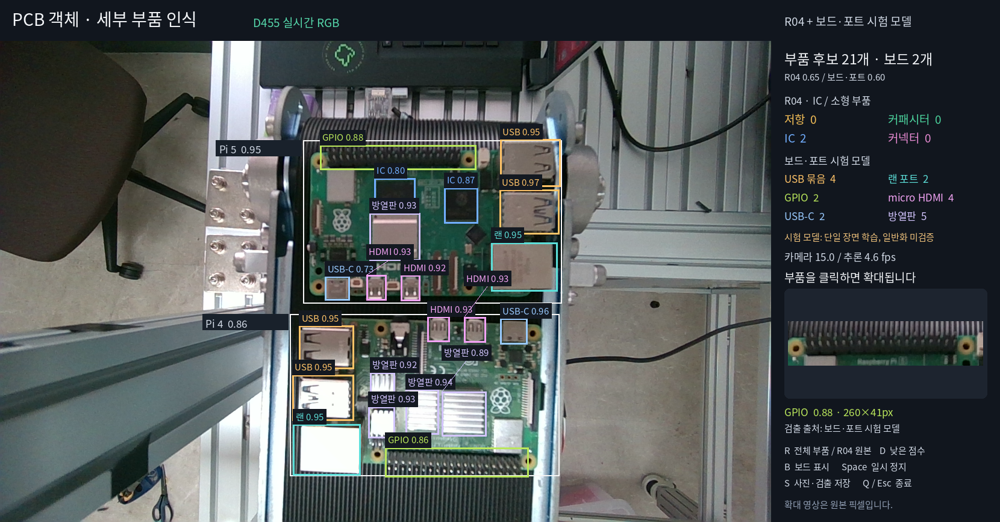

# D455 실시간 보드·부품 시험 · 2026-09-29

기존 R04의 IC/소형 부품 추론에 **로컬 보드·포트 시험 모델**을 함께 연결했다.
기록한 D455 영상에서 보드 2개와 부품 후보 21개를 표시했다. 추가 모델의 실제 가중치,
실행 코드, 학습 기록과 카메라 관찰 증거를 이 폴더에 보존한다.

**독립적인 실제 정확도 평가는 아니다.** 로컬 모델은 현재 보드 두 장을 담은 단일
장면의 합성 변형으로 학습·개발 검증했다. 높은 개발셋 점수를 다른 배치·보드·조명의
성능으로 해석하지 않는다. 저항·커패시터 누락은 남아 있다.

## 기록한 화면



2026-09-29 14:49:30 KST, 프레임 905에서 관찰한 **예측 개수**:

| 보드·부품 | 개수 | 모델 |
|---|---:|---|
| Pi 5 / Pi 4 보드 후보 | 1 / 1 | 로컬 시험 모델 |
| IC | 2 | R04 improved epoch16 |
| USB 묶음 | 4 | 로컬 시험 모델 |
| 랜 포트 / GPIO | 2 / 2 | 로컬 시험 모델 |
| micro HDMI / USB-C | 4 / 2 | 로컬 시험 모델 |
| 방열판 후보 | 5 | 로컬 시험 모델 |
| 저항 / 커패시터 / R04 일반 커넥터 | 0 / 0 / 0 | R04 |

USB 묶음은 겹쳐진 USB 단자 한 묶음이다. 개별 USB 구멍의 수와 다르다.
보드 2개는 부품 후보 21개에 포함하지 않는다. 이 수량은 TP/정답 개수가 아니다.

## 모델과 평가

- [모델 카드](MODEL_CARD.md), [가중치·추론 설정·SHA-256](selected_models.json)
- [평가 범위와 결과](evaluation/EVALUATION.md), [평가 요약 JSON](evaluation/summary.json)
- [실제 검출 좌표·모델 출처·속도](evaluation/verified-live.json)
- [기능 검증 기록](evaluation/verification.json), [다시 실행하는 검증 코드](verify_runtime.py)
- [업로드용 코드 검증](evaluation/package-verification.json), [192장·192개 라벨 재구성 대조](evaluation/dataset-reconstruction.json)
- [학습 기록](training/reports/results.csv), [학습 곡선](training/reports/results.png)
- [단일 장면 및 합성 분할 구성](training/dataset-manifest.json)

추가 모델 가중치 `models/board-parts-prototype.pt`는 이 Git 폴더에 포함한다.
기존 R03/R04 가중치는 각 Release를 그대로 사용한다. 새 R04 학습 또는 기존
공개자료 평가 점수의 갱신으로 해석하지 않는다.

## 실행

실제 사용 환경은 Ubuntu, Python 3.12, RTX 5060 Laptop GPU, torch 2.11.0+cu130,
torchvision 0.26.0+cu130이다. 나머지 주요 패키지는 `requirements.txt`에 기록했다.
CUDA에 맞는 Torch 환경과 Noto CJK 글꼴이 필요하다. 기존 R04 학습 환경과 버전이
다르지만 이 환경에서 가중치 로드와 원본 R04 예측 일치를 확인했다.

1. 저장소를 clone하고 이 폴더의 모델 SHA-256을 `SHA256SUMS`와 확인한다.
2. 기존 [R04 Release](https://github.com/hkjung1011/pcb-d455-component-vision/releases/tag/r04-2026-09-29)와
   [R03 Release](https://github.com/hkjung1011/pcb-d455-component-vision/releases/tag/r03-2026-09-28)에서
   `selected_models.json`에 기재된 두 가중치를 복원한다. 기본 모델 루트는 이 저장소 루트다.
   다른 경로에 복원했다면 `PCB_MODEL_ROOT`를 `R03/`, `R04/`를 포함하는 폴더로 지정한다.
3. `camera.example.json`을 `camera.local.json`으로 복사하고 D455 serial을 입력한다.
4. 준비된 Python 환경에서 실행한다.

```bash
cd D455_LIVE_2026-09-29
python live_view.py --config camera.local.json

# 카메라를 열지 않고 보존된 영상으로 추론
python live_view.py --check-image evaluation/verified-live-input.png --output sessions/replay

# 카메라를 열지 않는 기능 검증
python verify_runtime.py --output sessions/verification.json
```

R04 입력은 기존 dual 타일 구성과 FP32·NMS·0.65 기준을 유지한다. 추가 모델은
전체 영상 입력 1024, FP32, NMS 0.5, 기본 표시 기준 0.60이다.

- 부품 클릭: 원본 픽셀 확대와 검출 모델 출처 표시.
- **R**: 전체 부품 ↔ 기존 R04/R03 비교. 원래 R03은 두 보드를 하나로 잡을 수 있다.
- **D**: 0.25 이상 낮은 점수 후보. 얇은 상자와 `?`로 표시한다.
- **B**: 보드 상자, **Space**: 일시 정지, **S**: 사진·JSON 저장, **Q/Esc**: 종료.

`live.json`의 `counts`/`parts`는 현재 표시 모드에 맞춘다. 원래 R04 결과는
`r04_counts`/`r04_parts`, 원래 R03 결과는 `r03_boards`에 별도로 보존한다.

## 학습 재구성 및 자료 범위

`training/source/boards.png`는 원래 단일 보드 장면, `background.png`는 합성용
배경 촬영이다. 별도 보드를 촬영한 독립 시험 장면이 아니다.
`training/build_dataset.py`는 이 두 파일과 `seed-labels.json`에서 160/32개의
합성 train/val을 만든다. `training/train.py`는 공식 `yolo11s.pt` 초기 가중치로
학습한다. 소스·배경 경로만 저장소 배치에 맞게 바꿨으며 증강과 학습 설정은 보존했다.
기록된 원래 절대 작업 경로는 `${WORKSPACE}`로 치환했다.

```bash
python training/build_dataset.py
python training/train.py
```

원래 source/seed 주석에 기록된 경로는 당시 기록이며, 재구성 스크립트는 이 폴더의
`training/source/`를 읽는다. 공개 PCB/웨이퍼 원자료 이미지는 추가하지 않았다.
같은 장면에서 나온 합성 val 성적과 실제 카메라 관찰 결과를 구분해 사용한다.
업로드 준비 시 같은 환경에서 합성 이미지 192장과 라벨 192개가 원래 자료와 바이트
단위로 일치함을 확인했다. 원본 R04 좌표의 최대 차이는 0px였고 포장된 코드의
빈 입력·클릭 확대·모드 전환·평행 이동 검사도 통과했다.
