# Raspberry Pi 보드·부품 인식 R03 개발결과

기록일: 2026-09-28. 실제 공개자료로 네 모델을 학습하고 학습·검증에 쓰지 않은 시험셋을 평가했다. **D455 실사용 검증과 저항 포함 4종 부품 윤곽 분할은 아직 완료되지 않았다.**

클로드 검토 중 원본 해상도, 실제 optimizer 갱신 수, 보드별 분할, 원본 COCO 평가, 크기별 재현율, 검증셋 confidence 고정을 반영했다. 90/220에폭 확대와 8px·16px를 절대적인 검출 한계로 보는 해석은 적용하지 않았다. 자세한 판정은 [검토 반영 기록](claude_review_application.md)에 남겼다.

**현재 판단: 세부 부품의 실사용 수준에는 미달한다.** 기본 parts_yolo11s는 학습·검증에서 제외한 Pi3B 2장/189개에서 bbox mAP50–95 23.15%다. 검증에서 고정한 confidence 0.35, IoU≥0.5에서 93/189개를 찾았고, IC는 3/16개, 커넥터는 0/12개였다. 보드 전체 검출·외곽 분할 점수가 높아도 부품 인식 성공을 뜻하지 않는다.

3에폭은 라벨·메모리·실제 가중치 갱신이 정상인지 확인하는 점검 단계로 사용한다. 실사용 충분성을 에폭 수로 보장할 수 없다. 이번 비교는 보드 5에폭, 부품 20에폭으로 끝냈으며, 다음 우선순위는 실제 D455 원본 30장의 식별 가능성 점검과 검수된 부품 mask 확보다.

**추가로 발견한 오류:** 기존 micro-PCB 설명의 A/H/I와 실제 Raspberry Pi 사진이 일치하지 않았다. G/H/M으로 바로잡아 새로 학습했다. 과거 A/H/I 모델의 Raspberry Pi AP를 정상 성능으로 비교하지 않는다.

## 실제 학습한 모델

| 모델 | 역할 | 파라미터 | 전체 run 에폭 | 전체 run optimizer 갱신 | 선택 checkpoint / 입력 | confidence |
|---|---|---:|---:|---:|---|---:|
| parts_yolo11n | 4종 부품 bbox, 경량 | 2,590,620 | 20 | 1,164 | last_tile1024 | 0.60 |
| parts_yolo11s | 4종 부품 bbox, 비교 | 9,429,340 | 20 | 1,164 | best_tile1024 | 0.35 |
| board_yolo11n | RPi 보드 bbox | 2,590,035 | 5 | 2,605 | best_whole | 0.40 |
| board_yolo11n_seg | RPi 보드 외곽 mask | 2,842,803 | 5 | 1,432 | best_whole | 0.50 |

갱신 수는 전체 학습 run의 실제 누적 optimizer counter다. 앞선 에폭의 best.pt가 선택됐다고 해서 이 누적 횟수 전체가 해당 best 파일에 반영됐다는 뜻은 아니다. 체크포인트는 파일 SHA로 식별하고 에폭별 최소/최대 counter는 epoch_updates.json에 보존했다.

기본 부품 추론 모델은 검증셋 기준 **parts_yolo11s**로 선택했다. 기본 실행은 전체 원본 사진을 사용하며 ROI cascade는 별도 선택 기능이다. ROI cascade와 카메라 전체 처리의 mAP·지연은 아직 측정하지 않았다.

## 원본 정답 기반 시험 결과

아래 mAP는 IoU 0.50:0.95, COCO maxDets=100 기준이다. mAP50은 IoU 0.50에서의 AP다. 서로 다른 과제나 시험셋의 숫자를 하나의 모델 순위로 합치지 않는다.

| 모델 | 시험셋 | 사진 / 정답 | bbox mAP50 | bbox mAP50–95 | mask mAP50–95 | Precision / Recall |
|---|---|---:|---:|---:|---:|---:|
| parts_yolo11n | 일반 PCB holdout | 11 / 1,348 | 37.93% | 19.59% | 과제 아님 | 77.33% / 44.29% |
| parts_yolo11n | Pi3B 앞·뒤 holdout | 2 / 189 | 47.62% | 22.00% | 과제 아님 | 81.19% / 43.39% |
| parts_yolo11s | 일반 PCB holdout | 11 / 1,348 | 39.00% | 20.70% | 과제 아님 | 75.00% / 56.08% |
| parts_yolo11s | Pi3B 앞·뒤 holdout | 2 / 189 | 46.13% | 23.15% | 과제 아님 | 72.09% / 49.21% |
| board_yolo11n | 보드 source-group holdout | 895 / 426 | 99.71% | 74.45% | 과제 아님 | 99.05% / 97.65% |
| board_yolo11n_seg | 보드 source-group holdout | 490 / 166 | 99.84% | 91.07% | 96.28% | 97.58% / 96.99% |

Precision/Recall은 모델별 검증에서 정한 confidence와 box IoU≥0.5 기준이다. mask의 operating recall이 아니다. 부품이 밀집한 사진을 위한 maxDets=300 AP도 JSON과 그래프에 별도로 기록했다.

Pi 시험은 이번 파인튜닝에서 제외한 1개 보드 그룹의 2장이다. 공개 이미지가 사전학습 자료에 포함됐는지는 확인할 수 없다. 원본 unknown 67개는 4종 정답으로 추측하지 않았다. 이 작은 시험만으로 여러 실물 보드의 일반화나 전체 부품 인식률을 확정할 수 없다.

### Pi3B 종류별 결과

| 모델 | 부품 | 정답 | AP50–95 | Recall | TP / FP / FN |
|---|---|---:|---:|---:|---|
| parts_yolo11n | resistor | 57 | 28.41% | 52.63% | 30 / 9 / 27 |
| parts_yolo11n | capacitor | 104 | 31.24% | 47.12% | 49 / 8 / 55 |
| parts_yolo11n | ic | 16 | 17.21% | 18.75% | 3 / 1 / 13 |
| parts_yolo11n | connector | 12 | 11.15% | 0.00% | 0 / 1 / 12 |
| parts_yolo11s | resistor | 57 | 37.08% | 68.42% | 39 / 15 / 18 |
| parts_yolo11s | capacitor | 104 | 37.25% | 49.04% | 51 / 13 / 53 |
| parts_yolo11s | ic | 16 | 13.17% | 18.75% | 3 / 3 / 13 |
| parts_yolo11s | connector | 12 | 5.11% | 0.00% | 0 / 5 / 12 |

### 축소·블러 민감도

같은 Pi3B 189개 정답과 고정 confidence를 사용했다. 절반 크기로 축소 후 원래 크기로 보간한 영상, Gaussian σ=1 영상이다. **D455 촬영 결과가 아닌 합성 조건**이며 모델 선택에 사용하지 않았다.

| 모델 | 조건 | bbox AP50–95 | Recall |
|---|---|---:|---:|
| parts_yolo11n | 원본 | 22.00% | 43.39% |
| parts_yolo11n | 절반 해상도 | 21.60% | 38.62% |
| parts_yolo11n | Gaussian blur | 21.51% | 39.15% |
| parts_yolo11s | 원본 | 23.15% | 49.21% |
| parts_yolo11s | 절반 해상도 | 19.47% | 43.92% |
| parts_yolo11s | Gaussian blur | 19.63% | 43.92% |

## 추가 공개 사진과 실제 촬영 준비

[학습에 쓰지 않은 공개 사진 24장 추론 예시](reports/qualitative_external24/README.md)를 별도로 저장했다. 정답과 비교하지 않은 예시이므로 성공률·mAP 수치는 붙이지 않았다. 여러 보드·조명·각도에서 남는 누락 사례를 확인할 수 있다.

[라벨링·수집 가이드](annotation/target4_labeling_guide.md)에는 30장 파일럿, 조건부 200장 예산, 클래스·경계 규칙과 고유 부품 수 집계 방법을 기록했다. [D455 픽셀 예산](annotation/D455_PIXEL_BUDGET.md)은 실제 intrinsics 측정 전의 예시 계산이다. 신규 D455 사진·target4 검수 mask는 현재 각각 0개다.

## 구조와 그래프

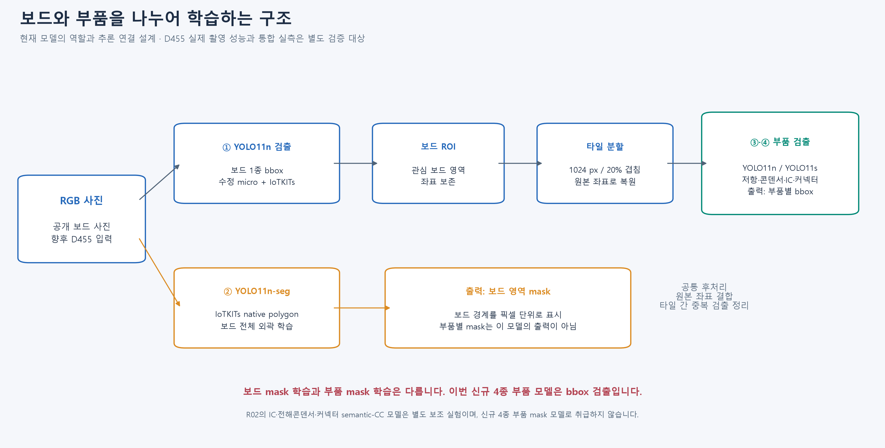

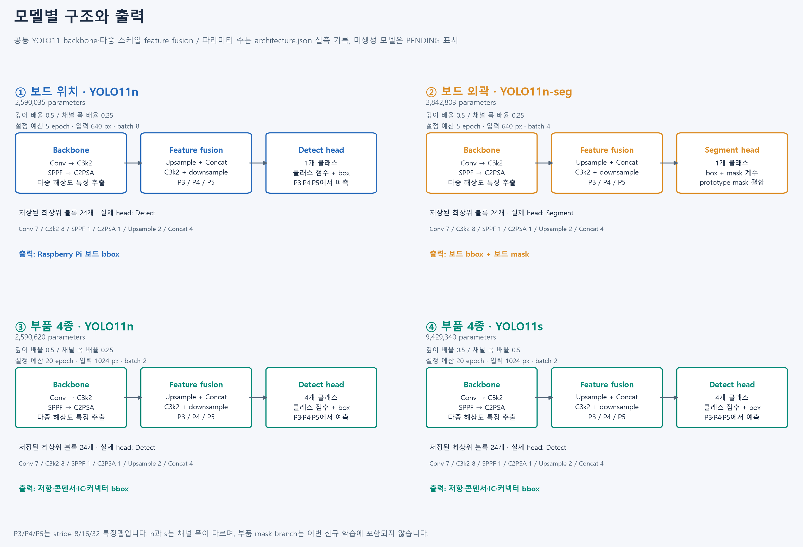

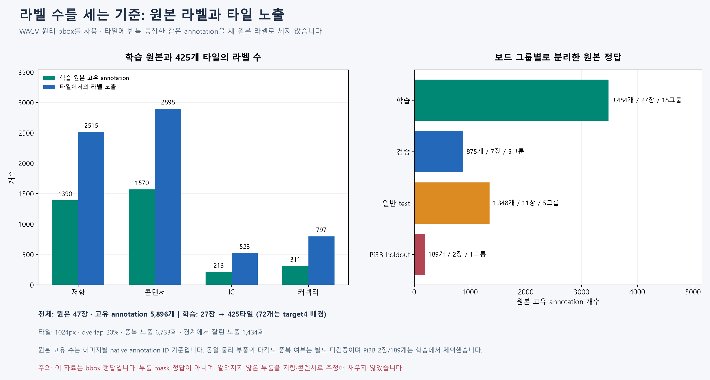

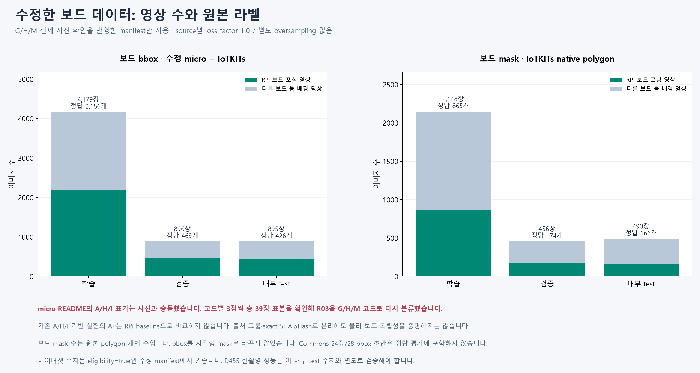

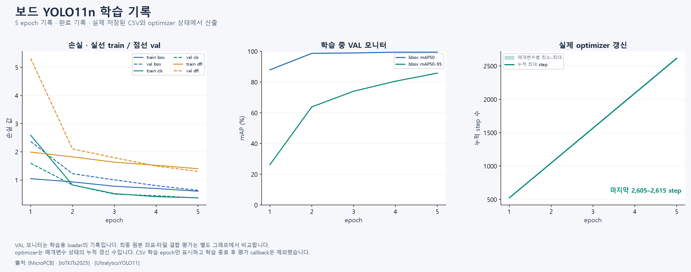

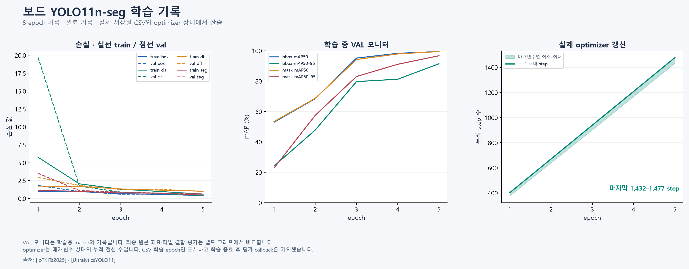

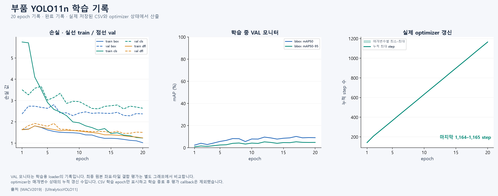

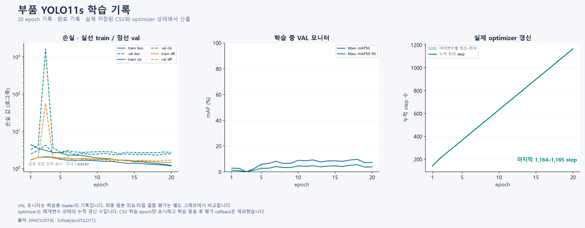

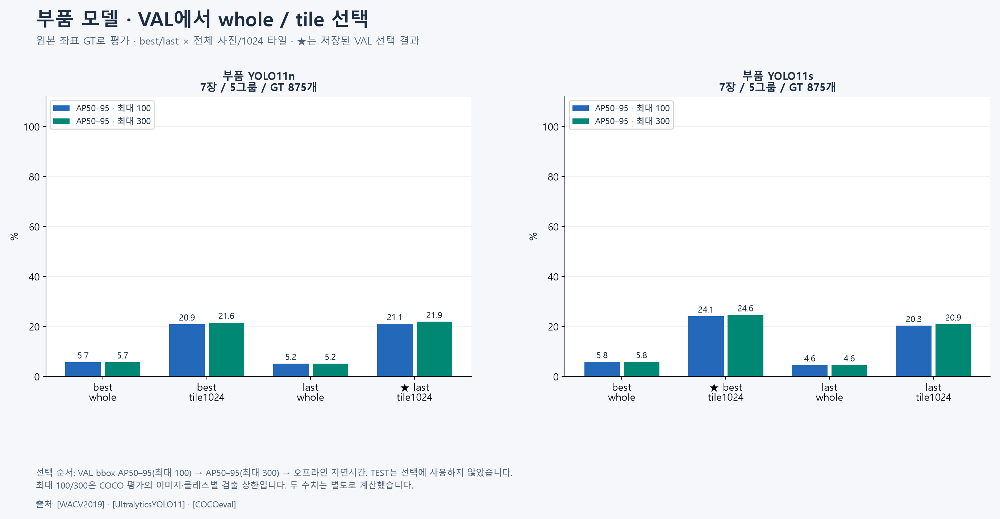

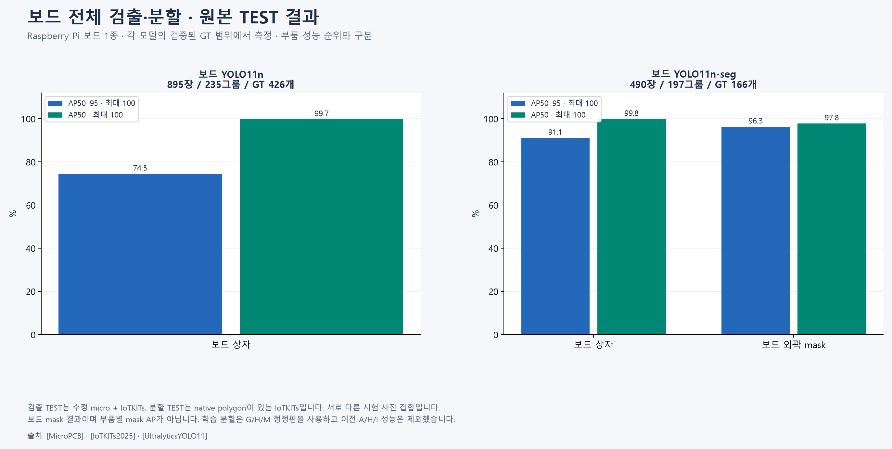

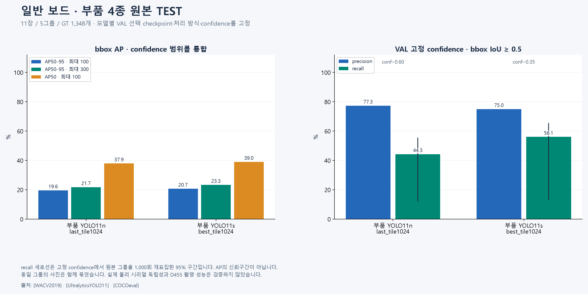

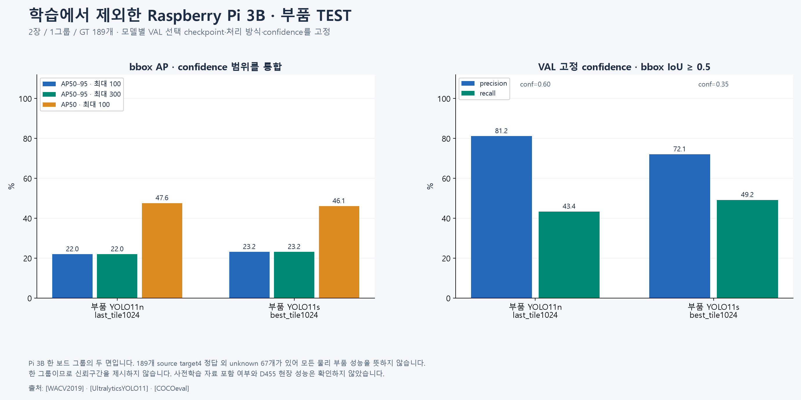

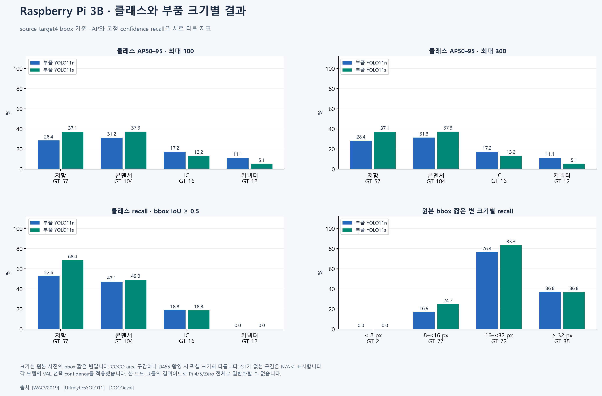

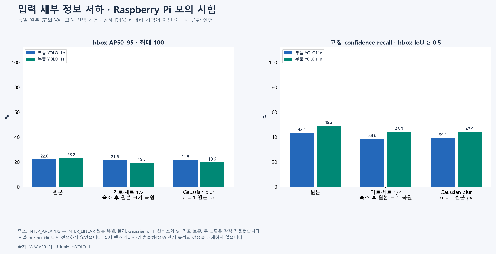

## 데이터·설정·한계의 상세 기록

이 작업의 Raspberry Pi는 **촬영·인식 대상**이다. 학습·추론 장비는 RTX 5060 Laptop 8GB PC이며 Raspberry Pi 배포 속도를 측정하지 않았다.

## 서로 다른 네 모델

| ID | 입력과 구조 | 학습 정답 | 출력 |
|---|---|---|---|
| board_yolo11n | RGB → YOLO11n → Detect | 수정 micro-PCB + IoTKITs | Raspberry Pi 보드 bbox 1종 |
| board_yolo11n_seg | RGB → YOLO11n → Segment + mask prototypes | IoTKITs 원본 polygon | Raspberry Pi 보드 외곽 mask 1종 |
| parts_yolo11n | RGB native tile → YOLO11n → Detect | WACV 원본 부품 bbox | 저항·커패시터·IC·커넥터 bbox |
| parts_yolo11s | RGB native tile → YOLO11s → Detect | 위와 같은 분할·정답 | 위와 같은 4종 bbox |

R02의 IC·전해콘덴서·커넥터 semantic 보조 실험은 별도로 보존한다. R03 보드 mask를 부품별 mask로 해석하면 안 된다. 저항을 포함하는 target4 instance mask는 검수한 polygon 정답을 확보한 뒤 학습한다.

## 실제 라벨과 학습 설정

보드 검출: 5,970장(학습 4,179 / 검증 896 / 시험 895). 다른 개발 보드는 음성 사례다. 원본 polygon이 있는 보드 분할: 3,094장(2,148 / 456 / 490), Raspberry Pi polygon 865 / 174 / 166개. 분할에 따라 음성 사진 수가 많으므로 사진 장수와 양성 객체 수를 혼동하지 않는다.

부품: 원본 47장, 이름 기준 보드 설계 29그룹, 4종 bbox 5,896개. 학습 27장/18그룹/3,484개, 검증 7장/5그룹/875개, 일반 시험 11장/5그룹/1,348개, Pi3B 시험 2장/1그룹/189개다. 학습에만 1024px·20% overlap 타일 425개를 만들었다. 부품 정답은 타일에서 6,733회 보이지만 새로운 원본 라벨이 6,733개 생긴 것은 아니다.

| 원본 부품 라벨 | 저항 | 커패시터 | IC | 커넥터 | 합계 |
|---|---:|---:|---:|---:|---:|
| 학습 | 1,390 | 1,570 | 213 | 311 | 3,484 |
| 검증 | 221 | 468 | 64 | 122 | 875 |
| 일반 시험 | 443 | 636 | 93 | 176 | 1,348 |
| Pi3B 시험 | 57 | 104 | 16 | 12 | 189 |
| 전체 | 2,111 | 2,778 | 386 | 621 | 5,896 |

이는 원본 사람이 제공한 bbox를 사용한 실제 수량이다. 현재 새 D455 사람 mask는 0개이며, 학습 타일의 중복 노출과 사람이 새로 그린 라벨 수를 합치지 않는다.

각 클래스의 추가 손실 가중치는 1.0이다. source sampling factor도 1.0이며 별도 클래스 oversampling은 없다. 다만 타일은 균일하게 뽑으므로 큰 원본과 겹친 부품은 더 많이 노출된다. loss gain은 box=7.5, cls=0.5, dfl=1.5, cls_pw=0이다. 설치된 Ultralytics의 segmentation loss gain은 box와 같은 7.5를 사용한다. 이는 모델 파라미터 수 또는 저장된 .pt 파일의 값과 다른 항목이다.

보드 모델은 5에폭, 부품 모델은 20에폭으로 제한했다. AdamW lr0=0.001, lrf=0.01, weight_decay=0.0005, nbs=8, FP32, seed=42다. 세부 설정과 실제 로더 인수는 configs와 각 실행의 args.yaml에 남긴다. 반복 횟수만으로 학습 성공을 판정하지 않고 optimizer state의 실제 step과 파라미터 변경을 확인한다.

## 평가 절차

1. 원본 보드·사진 family를 먼저 나누고 train에만 타일을 만든다. 보드 공개자료는 SHA256·source family·pHash 거리≤4 연결요소를 같은 split에 둔다. 촬영 실물의 시리얼 독립성까지 증명하는 것은 아니다.
2. 부품 모델별 best/last × whole/tile1024를 검증셋에서 비교한다. 원본 GT COCO bbox AP50–95@max100, 동률이면 max300, 그다음 지연 순으로 고른다.
3. 선택된 검증 결과에서 box IoU≥0.5 micro-F1 기준 confidence를 고정한다. 선택 JSON과 체크포인트 SHA를 저장한 뒤 일반 test와 Pi3B test를 실행한다.
4. AP50·AP50–95, 클래스별 AP, 고정 confidence의 precision/recall, 크기별 recall, 음성 사진 오검출률을 기록한다. mask AP는 보드 분할에만 계산한다. 그룹 bootstrap은 recall CI이며 AP CI가 아니다. Pi는 그룹이 하나라 일반화 CI를 만들지 않는다.
5. 절반 해상도와 Gaussian blur 실험은 카메라 열화에 대한 합성 민감도 검사다. 공개 JPEG를 열화시킨 결과를 D455 실측으로 부르지 않는다.

## 먼저 확인해야 하는 기존 데이터 오류

micro-PCB의 README A/H/I 설명과 실제 사진이 맞지 않았다. 13개 코드에서 서로 다른 조건 3장씩, 총 39장을 검토한 결과 Raspberry Pi는 G/H/M이었다. R03은 G/H/M 각 625장을 양성으로 다시 묶고 분할을 새로 만들었다. 기존 저장소와 과거 결과는 그대로 보존한다. A/H/I 기반 과거 Raspberry Pi 점수는 유효한 성능 기준으로 사용할 수 없다.

## D455 적용과 남은 경계

RGB 원본 픽셀 수·초점·조명·촬영 거리부터 확인한다. native tile은 전체 사진을 한 번에 축소하며 잃는 정보를 줄이지만, 촬영 때 없었던 작은 부품 정보는 만들어 내지 못한다. depth는 추후 보드 평면·거리 보조 정보로 사용할 수 있으며 현재 네 모델의 입력은 RGB다.

2026-09-28 SDK 조회에서는 D455 0대가 검색되어 실제 프레임을 취득하지 않았다. 이번 결과만으로 실물 Raspberry Pi 또는 D455 실사용 수준을 통과했다고 표시하지 않는다. 촬영 파이프라인, ROI cascade 전체 성능, 500프레임 지연, target4 부품 mask는 추가 검증 대상이다.

Pi3B 원본에는 target4 이외 unknown 67개가 있다. 이 자료의 189개 정답에 대한 AP는 전체 BOM 또는 모든 부품에 대한 완전한 정답률이 아니다. COCO 사전학습 자료와 공개 시험 사진의 잠재적 중복 여부도 확인되지 않았다.

## 출처

- [IoTKITs v1, AnhTuấn Đỗ Nguyễn](https://data.mendeley.com/datasets/x5thzmkxhy/1): CC BY 4.0. 내려받은 3,108장과 논문 설명 수량은 구분했다. source geometry를 보존하고 전역 분할을 재구성했다.
- [micro-PCB, frettapper](https://www.kaggle.com/datasets/frettapper/micropcb-images): 출처 기록 CC BY 4.0. 기존 로컬 에셋을 사용하고 위 클래스 매핑 오류를 정정했다.
- [Kuo et al. PCB Component Detection, WACV 2019](https://sites.google.com/view/chiawen-kuo/home/pcb-component-detection): 저자 연결 ZIP에서 실제 47장·XML을 확보했다. 공개 다운로드 가능하나 원본 archive에 명시적 라이선스는 없다. 원본 이미지 묶음은 별도로 재포장하지 않는다.
- [Ultralytics 학습 설정](https://docs.ultralytics.com/modes/train/), [추론 설정](https://docs.ultralytics.com/modes/predict/): 실행은 설치된 8.4.120 코드·args를 기준으로 기록한다. 모델 및 라이브러리의 AGPL-3.0/별도 상용 라이선스 조건을 데이터 라이선스와 구분한다.
- Wikimedia Commons 사진은 각 이미지별 출처·작성자·라이선스를 commons_records.json에 기록한다. 사진 24장에 assistant가 작성한 보드 bbox 28개는 검토용 초안이며 정량 평가 정답으로 사용하지 않는다. 모델 예측을 표시한 24장 갤러리는 별도로 제공한다.


## 실행과 파일

평가·선택·추론 CPU 검사 28개를 통과했다. [최종 평가 감사](reports/final_evaluation_audit.json)는 20개 평가 작업의 원본 정답·운영 TP/FP/FN을 독립 대조하고 Pi n/s bbox와 보드 mask AP를 공식 COCO로 재계산해 일치를 확인했다. [추론 일치 검증](reports/inference_equivalence.json)은 Pi 원본 한 장의 부품 16개 class/bbox/score가 기존 평가 기록과 정확히 같음을 확인한다. 이는 평가 방법과 구현의 검증이며 실사용 성능 합격은 아니다.

이미지 추론: Python 환경에서 다음 명령을 실행한다. [추론 설명](INFERENCE.md)에 폴더 입력·원본 좌표·보드 mask·선택 JSON 규약이 있다.

```powershell
& 'C:/Users/hkjun/Documents/mcu-vision/.venv-yolo11/Scripts/python.exe' -B scripts/infer_rpi.py --input 'C:/images/board.jpg' --output 'C:/results/r03_run01' --device 0
```

학습·평가는 같은 PC의 원본 데이터 캐시를 참조한다. raw 사진/ZIP은 이 패키지에 반복 복사하지 않았다. local_data_paths.json에 위치를 남겼다. 모델·추론 코드는 패키지 내부 경로를 쓰지만, 패키지만 다른 PC로 옮겨 학습 자료까지 복원되는 구성은 아니다.

각 모델의 best.pt/last.pt, 구조, 환경, 설정, 학습곡선, 실제 update, 선택 근거와 체크포인트 SHA를 포함했다. 재학습은 기존 결과를 덮지 않도록 config의 run_dir를 새로운 이름으로 바꾼 뒤 실행한다. 검증·시험 재실행도 새 output-root를 지정한다.

상세 지표: reports/evaluation_suite/aggregate.json. 원본 GT/예측: 같은 폴더 evaluations. 클래스/부품 수·출처·분할·loss는 model_registry.json과 data 및 component_assets 폴더의 manifest에서 추적한다.

다음 실제 촬영·라벨 예산과 경계 규칙은 annotation 폴더에 있다. 현재 공개자료 결과를 실사용 승인 또는 target4 mask 완료로 기록하지 않는다.
