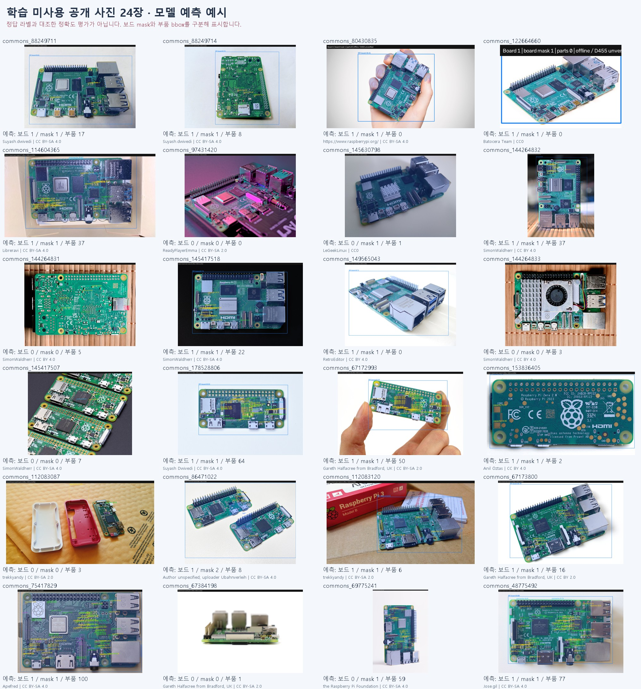

# 공개 사진 24장 추론 예시

R03 학습에 쓰지 않은 Commons 사진에 검증셋에서 고정한 모델과 confidence를 적용했다. 정답 라벨과 대조한 mAP/recall 시험이 아니다. 표시된 검출 수를 정답 수나 성공률로 해석하지 않는다. 물리 보드의 독립성과 사전학습 자료 중복 여부는 미검증이다.

assistant가 작성한 28 bbox 초안은 별도 검토 자료이며 이번 정확도 계산에 사용하지 않았다. 원본 사진의 작성자·라이선스와 예측 표시 변경 내역은 각 폴더 ATTRIBUTION.json에 있다.

- **commons_88249711**: [File:Raspberry Pi 4, 2 GB RAM version.jpg](https://commons.wikimedia.org/wiki/File:Raspberry_Pi_4,_2_GB_RAM_version.jpg) · Suyash.dwivedi · [CC BY-SA 4.0](https://creativecommons.org/licenses/by-sa/4.0). 변경: 모델 예측 상자·보드 마스크 표시. [예측 이미지](commons_88249711_4c85535042/annotated.png), [상세 JSON](commons_88249711_4c85535042/prediction.json).
- **commons_88249714**: [File:Raspberry Pi 4, 2 GB RAM version 3.jpg](https://commons.wikimedia.org/wiki/File:Raspberry_Pi_4,_2_GB_RAM_version_3.jpg) · Suyash.dwivedi · [CC BY-SA 4.0](https://creativecommons.org/licenses/by-sa/4.0). 변경: 모델 예측 상자·보드 마스크 표시. [예측 이미지](commons_88249714_b2ba0e477d/annotated.png), [상세 JSON](commons_88249714_b2ba0e477d/prediction.json).
- **commons_80430835**: [File:Raspberry Pi 4.jpg](https://commons.wikimedia.org/wiki/File:Raspberry_Pi_4.jpg) · https://www.raspberrypi.org/ · [CC BY-SA 4.0](https://creativecommons.org/licenses/by-sa/4.0). 변경: 모델 예측 상자·보드 마스크 표시. [예측 이미지](commons_80430835_57ddf7e614/annotated.png), [상세 JSON](commons_80430835_57ddf7e614/prediction.json).
- **commons_122664660**: [File:Raspberry Pi 4 B.png](https://commons.wikimedia.org/wiki/File:Raspberry_Pi_4_B.png) · Batocera Team · [CC0](http://creativecommons.org/publicdomain/zero/1.0/deed.en). 변경: 모델 예측 상자·보드 마스크 표시. [예측 이미지](commons_122664660_e43e459a13/annotated.png), [상세 JSON](commons_122664660_e43e459a13/prediction.json).
- **commons_114604365**: [File:Raspberry Pi 4 Computer.jpg](https://commons.wikimedia.org/wiki/File:Raspberry_Pi_4_Computer.jpg) · Libreravi · [CC BY-SA 4.0](https://creativecommons.org/licenses/by-sa/4.0). 변경: 모델 예측 상자·보드 마스크 표시. [예측 이미지](commons_114604365_262c7b3798/annotated.png), [상세 JSON](commons_114604365_262c7b3798/prediction.json).
- **commons_97431420**: [File:Raspberry Pi 4 Model B With Fancy Lights ^ ^ (50642601981).png](https://commons.wikimedia.org/wiki/File:Raspberry_Pi_4_Model_B_With_Fancy_Lights_%5E_%5E_(50642601981).png) · ReadyPlayerEmma · [CC BY-SA 2.0](https://creativecommons.org/licenses/by-sa/2.0). 변경: 모델 예측 상자·보드 마스크 표시. [예측 이미지](commons_97431420_545631e3f2/annotated.png), [상세 JSON](commons_97431420_545631e3f2/prediction.json).
- **commons_145630798**: [File:Raspberry-Pi 5.jpg](https://commons.wikimedia.org/wiki/File:Raspberry-Pi_5.jpg) · LeGeekLinux · [CC0](http://creativecommons.org/publicdomain/zero/1.0/deed.en). 변경: 모델 예측 상자·보드 마스크 표시. [예측 이미지](commons_145630798_aaeae3825e/annotated.png), [상세 JSON](commons_145630798_aaeae3825e/prediction.json).
- **commons_144264832**: [File:Raspberry Pi 5 (vertical).jpg](https://commons.wikimedia.org/wiki/File:Raspberry_Pi_5_(vertical).jpg) · SimonWaldherr · [CC BY 4.0](https://creativecommons.org/licenses/by/4.0). 변경: 모델 예측 상자·보드 마스크 표시. [예측 이미지](commons_144264832_db66710aa1/annotated.png), [상세 JSON](commons_144264832_db66710aa1/prediction.json).
- **commons_144264831**: [File:Raspberry Pi 5 Backside.jpg](https://commons.wikimedia.org/wiki/File:Raspberry_Pi_5_Backside.jpg) · SimonWaldherr · [CC BY 4.0](https://creativecommons.org/licenses/by/4.0). 변경: 모델 예측 상자·보드 마스크 표시. [예측 이미지](commons_144264831_851729a741/annotated.png), [상세 JSON](commons_144264831_851729a741/prediction.json).
- **commons_145417518**: [File:Raspberry Pi 5 Board.jpg](https://commons.wikimedia.org/wiki/File:Raspberry_Pi_5_Board.jpg) · SimonWaldherr · [CC BY-SA 4.0](https://creativecommons.org/licenses/by-sa/4.0). 변경: 모델 예측 상자·보드 마스크 표시. [예측 이미지](commons_145417518_6346c26b44/annotated.png), [상세 JSON](commons_145417518_6346c26b44/prediction.json).
- **commons_149565043**: [File:Raspberry Pi 5 Computer.jpg](https://commons.wikimedia.org/wiki/File:Raspberry_Pi_5_Computer.jpg) · RetroEditor · [CC BY 4.0](https://creativecommons.org/licenses/by/4.0). 변경: 모델 예측 상자·보드 마스크 표시. [예측 이미지](commons_149565043_fc85fe6124/annotated.png), [상세 JSON](commons_149565043_fc85fe6124/prediction.json).
- **commons_144264833**: [File:Raspberry Pi 5 with active cooler.jpg](https://commons.wikimedia.org/wiki/File:Raspberry_Pi_5_with_active_cooler.jpg) · SimonWaldherr · [CC BY 4.0](https://creativecommons.org/licenses/by/4.0). 변경: 모델 예측 상자·보드 마스크 표시. [예측 이미지](commons_144264833_5244c788fa/annotated.png), [상세 JSON](commons_144264833_5244c788fa/prediction.json).
- **commons_145417507**: [File:4 Raspberry Pi Zero Boards.jpg](https://commons.wikimedia.org/wiki/File:4_Raspberry_Pi_Zero_Boards.jpg) · SimonWaldherr · [CC BY-SA 4.0](https://creativecommons.org/licenses/by-sa/4.0). 변경: 모델 예측 상자·보드 마스크 표시. [예측 이미지](commons_145417507_699eee79ba/annotated.png), [상세 JSON](commons_145417507_699eee79ba/prediction.json).
- **commons_178528806**: [File:Raspberry PI Zero 2W TOP 02.jpg](https://commons.wikimedia.org/wiki/File:Raspberry_PI_Zero_2W_TOP_02.jpg) · Suyash Dwivedi · [CC BY-SA 4.0](https://creativecommons.org/licenses/by-sa/4.0). 변경: 모델 예측 상자·보드 마스크 표시. [예측 이미지](commons_178528806_ebcadda52e/annotated.png), [상세 JSON](commons_178528806_ebcadda52e/prediction.json).
- **commons_67172993**: [File:Raspberry Pi Zero (23021815320).png](https://commons.wikimedia.org/wiki/File:Raspberry_Pi_Zero_(23021815320).png) · Gareth Halfacree from Bradford, UK · [CC BY-SA 2.0](https://creativecommons.org/licenses/by-sa/2.0). 변경: 모델 예측 상자·보드 마스크 표시. [예측 이미지](commons_67172993_ca7806a131/annotated.png), [상세 JSON](commons_67172993_ca7806a131/prediction.json).
- **commons_153836405**: [File:Raspberry Pi Zero 2 W -- 2024 -- 0012.jpg](https://commons.wikimedia.org/wiki/File:Raspberry_Pi_Zero_2_W_--_2024_--_0012.jpg) · Anil Öztas · [CC BY 4.0](https://creativecommons.org/licenses/by/4.0). 변경: 모델 예측 상자·보드 마스크 표시. [예측 이미지](commons_153836405_54b368c543/annotated.png), [상세 JSON](commons_153836405_54b368c543/prediction.json).
- **commons_112083087**: [File:Raspberry Pi Zero W (20170828 194225).jpg](https://commons.wikimedia.org/wiki/File:Raspberry_Pi_Zero_W_(20170828_194225).jpg) · trekkyandy · [CC BY-SA 2.0](https://creativecommons.org/licenses/by-sa/2.0). 변경: 모델 예측 상자·보드 마스크 표시. [예측 이미지](commons_112083087_8d2a11ed20/annotated.png), [상세 JSON](commons_112083087_8d2a11ed20/prediction.json).
- **commons_86471022**: [File:Raspberry Pi Zero W vs Zero.jpeg](https://commons.wikimedia.org/wiki/File:Raspberry_Pi_Zero_W_vs_Zero.jpeg) · Author unspecified; uploader Ubahnverleih · [CC BY-SA 4.0](https://creativecommons.org/licenses/by-sa/4.0). 변경: 모델 예측 상자·보드 마스크 표시. [예측 이미지](commons_86471022_6d50385f80/annotated.png), [상세 JSON](commons_86471022_6d50385f80/prediction.json).
- **commons_112083120**: [File:Raspberry Pi 3 (20170828 203048).jpg](https://commons.wikimedia.org/wiki/File:Raspberry_Pi_3_(20170828_203048).jpg) · trekkyandy · [CC BY-SA 2.0](https://creativecommons.org/licenses/by-sa/2.0). 변경: 모델 예측 상자·보드 마스크 표시. [예측 이미지](commons_112083120_b8da096aa1/annotated.png), [상세 JSON](commons_112083120_b8da096aa1/prediction.json).
- **commons_67173800**: [File:Raspberry Pi 3 (24651527564).png](https://commons.wikimedia.org/wiki/File:Raspberry_Pi_3_(24651527564).png) · Gareth Halfacree from Bradford, UK · [CC BY 2.0](https://creativecommons.org/licenses/by/2.0). 변경: 모델 예측 상자·보드 마스크 표시. [예측 이미지](commons_67173800_110887e39e/annotated.png), [상세 JSON](commons_67173800_110887e39e/prediction.json).
- **commons_75417829**: [File:Raspberry Pi 3 B+.jpg](https://commons.wikimedia.org/wiki/File:Raspberry_Pi_3_B%2B.jpg) · Apefred · [CC BY-SA 4.0](https://creativecommons.org/licenses/by-sa/4.0). 변경: 모델 예측 상자·보드 마스크 표시. [예측 이미지](commons_75417829_c8f5237d11/annotated.png), [상세 JSON](commons_75417829_c8f5237d11/prediction.json).
- **commons_67384198**: [File:Raspberry Pi 3 B+ (25929660397).png](https://commons.wikimedia.org/wiki/File:Raspberry_Pi_3_B%2B_(25929660397).png) · Gareth Halfacree from Bradford, UK · [CC BY-SA 2.0](https://creativecommons.org/licenses/by-sa/2.0). 변경: 모델 예측 상자·보드 마스크 표시. [예측 이미지](commons_67384198_e810089219/annotated.png), [상세 JSON](commons_67384198_e810089219/prediction.json).
- **commons_69775241**: [File:Raspberry Pi 3 Model B+.jpg](https://commons.wikimedia.org/wiki/File:Raspberry_Pi_3_Model_B%2B.jpg) · the Raspberry Pi Foundation · [CC BY-SA 4.0](https://creativecommons.org/licenses/by-sa/4.0). 변경: 모델 예측 상자·보드 마스크 표시. [예측 이미지](commons_69775241_2d6e0c3904/annotated.png), [상세 JSON](commons_69775241_2d6e0c3904/prediction.json).
- **commons_48775492**: [File:Raspberry Pi 3 Model B.JPG](https://commons.wikimedia.org/wiki/File:Raspberry_Pi_3_Model_B.JPG) · Jose.gil · [CC BY-SA 4.0](https://creativecommons.org/licenses/by-sa/4.0). 변경: 모델 예측 상자·보드 마스크 표시. [예측 이미지](commons_48775492_c43bc19c7c/annotated.png), [상세 JSON](commons_48775492_c43bc19c7c/prediction.json).
