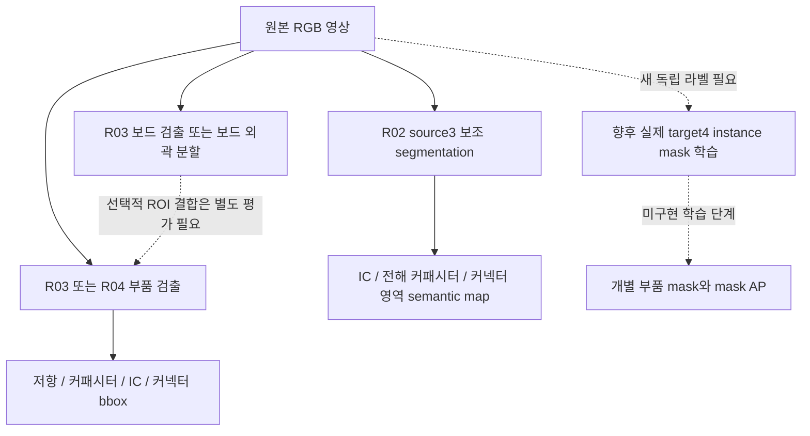
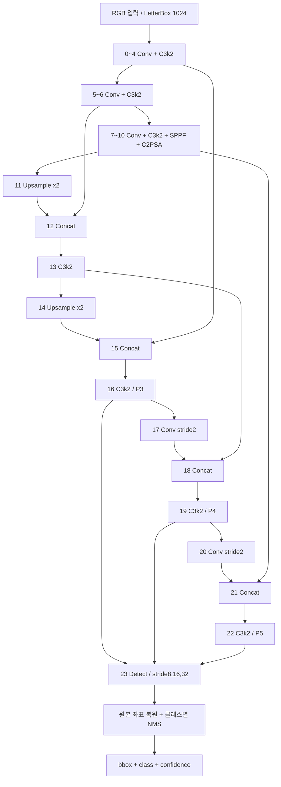
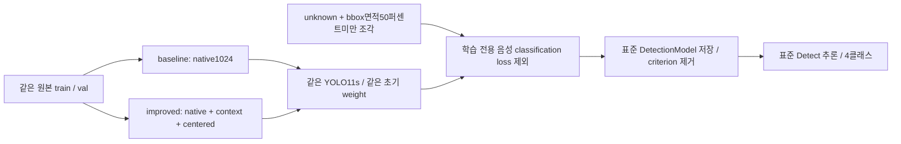

# 모델별 구조·역할·재사용 범위

2026-09-28. R02/R03는 기존 기록을 인용했고, R04는 기준 팔의 epoch02 체크포인트를 **CPU로만 로드해 구조를 직접 확인**했다. 이 문서는 모델의 과제와 구조를 구분하는 기록이다. R04 성능은 기재하지 않으며 최종 선택·지표는 결과 README와 selection 기록을 확인한다. 모든 모델의 실제 D455 성능은 미검증이다.

## 모델 가족

| 모델 | 실제 구조 / 파라미터 수 | 목표와 정답 | 입력 → 출력 | 재사용 범위 |
|---|---|---|---|---|
| R02 source3 보조 모델 | YOLO11n-seg. 검토한 R02 문서에 파라미터 수 미기록 | IC·전해 커패시터·커넥터 영역 3종. PCBVision 원본 semantic mask; 학습은 연결영역에서 파생한 약한 polygon | RGB 전체 입력 1024 → segmentation 후보 → 원본 좌표의 클래스별 semantic map | source3 실험. 저항 감독 신호 없음, 일반 MLCC를 포함한 capacitor 4종 모델로 사용할 수 없음 |
| R03 board_yolo11n | YOLO11n Detect / **2,590,035** | Raspberry Pi 보드 전체 1종. 보드 bbox | RGB 전체 입력 640 → 보드 bbox·점수 | 보드 위치 찾기. 부품 또는 보드 윤곽 mask를 출력하는 모델 아님 |
| R03 board_yolo11n_seg | YOLO11n Segment / **2,842,803** | 보드 전체 1종. IoTKITs 원본 보드 polygon | RGB 전체 입력 640 → 보드 bbox·외곽 mask·점수 | 보드 영역 추출. 보드 위 부품 mask를 학습한 것은 아님 |
| R03 parts_yolo11n | YOLO11n Detect / **2,590,620** | R/C/IC/connector 4종. WACV 원본 bbox | RGB 1024 타일 → 개별 부품 bbox·종류·점수, 원본 좌표 병합 | 공개 자료의 작은 검출 모델 비교 기준. instance mask 없음 |
| R03 parts_yolo11s | YOLO11s Detect / **9,429,340** | 위와 같은 4종 bbox | RGB 1024 타일 → 개별 부품 bbox·종류·점수 | R03 val에서 고른 기본 부품 모델. n보다 일반적으로 우수하다는 통계적 결론은 아님 |
| R04 baseline | **같은 YOLO11s Detect / 9,429,340** | 새 고정 train/val의 같은 4종 bbox, native1024 view | RGB 입력 1024 → 4종 bbox. native/dual 추론 후보를 val에서 비교 | R04 개선 팔과 비교하는 기준. R03 가중치에서 이어 학습하지 않음 |
| R04 improved | **같은 YOLO11s Detect / 9,429,340** | 같은 원본·분할. native+2048 문맥+객체 중심 view, unknown/심한 조각의 학습 loss ignore | 같은 RGB 입력·같은 Detect 출력 | 데이터 view와 학습 loss 처리의 개선 묶음. 별도의 새 추론 신경망 구조나 segmentation 모델 아님 |

R=저항, C=커패시터다. **7개 모델 기록이 7개 서로 다른 네트워크 구조를 뜻하지 않는다.** 특히 R04 두 팔은 동일 구조와 동일 초기 가중치를 사용하고 학습 자료/ignore 적용만 다르다. RGB 3채널이 모델 입력이며 D455 depth를 입력 채널로 합친 RGB-D 네트워크는 이번 기록에 없다.

R02 foreground mIoU, R03 보드 bbox/mask AP, R03/R04 부품 bbox AP는 목표·정답·분할이 다르므로 하나의 점수표로 직접 순위를 매기지 않는다. source3와 target4의 class ID도 서로 다르다.

## 역할을 분리한 전체 흐름

보드 ROI를 부품 모델 앞에 붙이면 입력 분포와 누락 경로가 바뀐다. 이 도식의 선택적 연결은 결합 성능이 검증됐다는 뜻이 아니다. 보드가 검출되지 않으면 부품을 모두 생략하는 cascade의 성능도 별도로 평가해야 한다.

## R04 실제 체크포인트에서 확인한 구조

- 표본: `runs/baseline/candidates/epoch_02.pt`. **구조 확인용 표본이며 최종 선택 모델이 아니다.**
- 모델 클래스: `ultralytics.nn.tasks.DetectionModel`.
- 파라미터: **9,429,340개**, 최상위 그래프 노드 **24개**.
- Head: `Detect`, `from=[16,19,22]`, `nc=4`, `reg_max=16`, feature stride **8/16/32**, end2end=false.
- 4종 순서: `0 resistor`, `1 capacitor`, `2 ic`, `3 connector`.
- stride 4의 별도 검출 출력을 갖지 않는다. 그렇다고 8px 미만 물체가 수학적으로 검출 불가능하다는 뜻은 아니다.
- 이 감사에서 forward·추론·optimizer 갱신은 모두 **0회**다. 체크포인트를 CPU에 매핑하고 속성·파라미터 수·그래프 연결만 읽었다.

아래 도식은 실제 layer index와 from 연결을 요약한다. Conv의 stride 2는 해당 연산의 국소 stride이며 Detect의 8/16/32는 입력 영상에 대한 feature stride다.

### 실제 layer 목록

`from=-1`은 직전 노드다. `—`는 해당 최상위 모듈에 stride 속성이 직접 노출되지 않았다는 뜻이며 stride 0이라는 의미가 아니다. 각 세부 모듈을 펼친 전체 개수와 원본 YAML은 `model_architecture.json`에 있다.

| index | from | type | parameters | 직접 확인한 stride / upsample |
|---:|---|---|---:|---|

| 0 | -1 | Conv | 928 | [2, 2] |
| 1 | -1 | Conv | 18,560 | [2, 2] |
| 2 | -1 | C3k2 | 26,080 | — |
| 3 | -1 | Conv | 147,712 | [2, 2] |
| 4 | -1 | C3k2 | 103,360 | — |
| 5 | -1 | Conv | 590,336 | [2, 2] |
| 6 | -1 | C3k2 | 346,112 | — |
| 7 | -1 | Conv | 1,180,672 | [2, 2] |
| 8 | -1 | C3k2 | 1,380,352 | — |
| 9 | -1 | SPPF | 656,896 | — |
| 10 | -1 | C2PSA | 990,976 | — |
| 11 | -1 | Upsample | 0 | x2.0 upsample |
| 12 | [-1, 6] | Concat | 0 | — |
| 13 | -1 | C3k2 | 443,776 | — |
| 14 | -1 | Upsample | 0 | x2.0 upsample |
| 15 | [-1, 4] | Concat | 0 | — |
| 16 | -1 | C3k2 | 127,680 | — |
| 17 | -1 | Conv | 147,712 | [2, 2] |
| 18 | [-1, 13] | Concat | 0 | — |
| 19 | -1 | C3k2 | 345,472 | — |
| 20 | -1 | Conv | 590,336 | [2, 2] |
| 21 | [-1, 10] | Concat | 0 | — |
| 22 | -1 | C3k2 | 1,511,424 | — |
| 23 | [16, 19, 22] | Detect | 820,956 | [8.0, 16.0, 32.0] |

R03 parts_yolo11s의 보관된 architecture.json과 R04의 최상위 노드 type/from/파라미터 수 24개도 일치했다. R02와 다른 R03 모델은 기존 문서·architecture.json을 사용했으며 이번에 그 체크포인트를 다시 로드해 세부 속성을 확인한 것으로 표시하지 않는다.

## 학습에서 달라지는 부분과 표준 체크포인트

두 팔의 `start.json`에서 초기 checkpoint SHA와 실제 초기 model parameter SHA가 일치했다. 입력·그룹 sampling·증강·optimizer 예산은 공유한다. 개선 팔의 ignore는 dataset/loss에서만 적용하며, 할당된 positive와 positive 영역을 우선한다. bbox/DFL loss와 Detect 추론 head를 새 구조로 교체한 것이 아니다. baseline도 같은 학습 경로를 사용하지만 ignore sidecar가 비어 있다.

학습 중 메모리에는 ignore용 좌표/임시 class -1이 있지만, 저장된 YOLO 정답과 배포 출력은 class 0~3이다. epoch 후보를 저장할 때 학습 criterion을 제거하고 표준 DetectionModel을 저장한다. CPU에서 읽은 epoch02는 criterion=null, 모델 모듈 type은 모두 torch/ultralytics 소속이었다. 따라서 이 후보를 표준 모델로 로드하는 데 R04 전용 inference layer가 필요하지 않다는 구조적 근거가 있다. 확인 환경은 Ultralytics 8.4.120이며 다른 버전, ONNX 또는 TensorRT export 성공까지 인증한 것은 아니다.

저장 파일의 tensor dtype은 FP16이었다. 이는 `train_r04.py`가 EMA 사본을 `.half()`로 직렬화한 결과이며, **FP32 학습 설정과 모순되지 않는다.** 저장된 EMA의 requires_grad가 모두 false라는 사실도 학습 중 파라미터가 고정돼 있었다는 뜻이 아니다. 이 파일은 optimizer 상태를 보존하지 않으므로 정확한 optimizer 재개용 스냅샷으로 취급하지 않는다.

## 출처와 식별자

- R04 공식 초기 `yolo11s.pt` SHA256: `85a76fe86dd8afe384648546b56a7a78580c7cb7b404fc595f97969322d502d5`.
- R04 두 팔의 초기 model parameter SHA256: `9e44a6a12ec1fc7e37a830f904c1a48afb76782a10668f2cc48c729a12ec4d20`.
- CPU로 조사한 baseline epoch02 SHA256: `e540ad9d2d066aa485e96d9876dd34574c878c2209e27d1d4f73710256193e4a`.
- R02: `PCB_D455_R02_개발결과.md`, `PCB_D455_R02/models/model_sources.json`의 실제 기록. 선택된 source3 checkpoint SHA도 JSON에 보존.
- R03: `work/r03/runs/{model_id}/architecture.json`. 실제 층 목록·YAML·기록된 파라미터 수를 JSON에 보존.
- R04: `protocol.json`, 두 팔의 `runs/{arm}/start.json`, `scripts/train_r04.py`와 `ignore_adapter.py`.

전체 경로·근거 SHA·모델별 대상·정답·입출력·재사용 한계는 `model_architecture.json`에 있다. 결과 README에 선택된 가중치·평가 결과가 확정되기 전에는 이 구조 표본을 최종 기본 모델이라고 배포하지 않는다.
