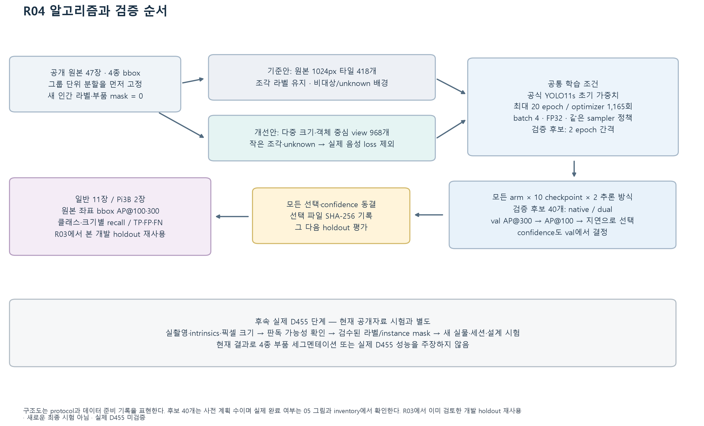
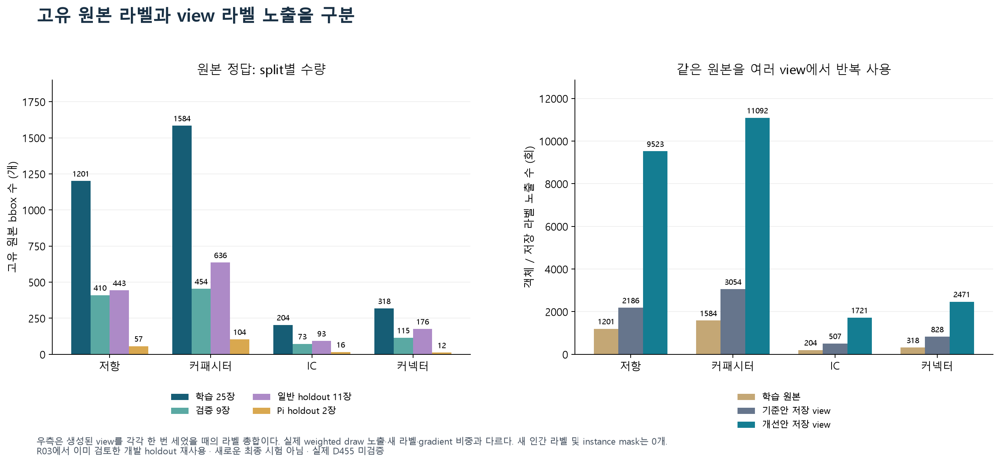
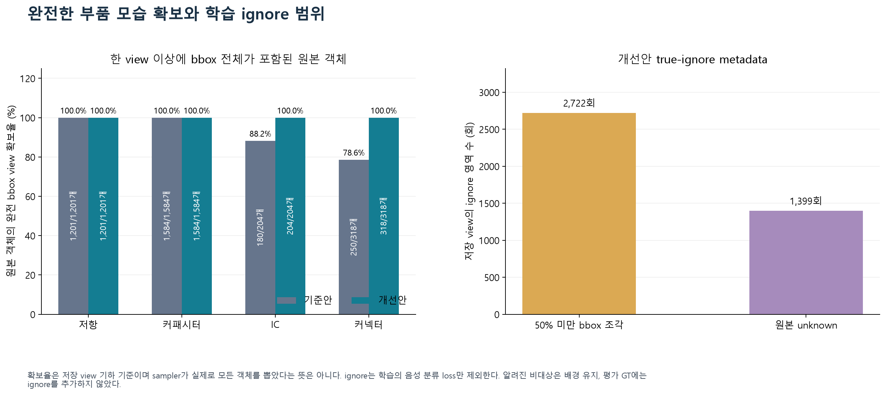
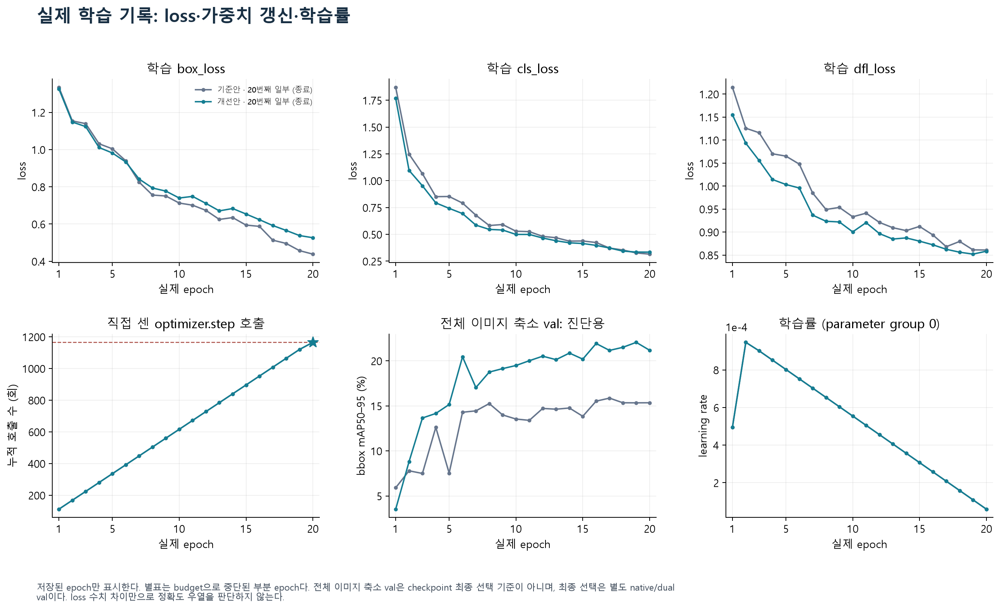
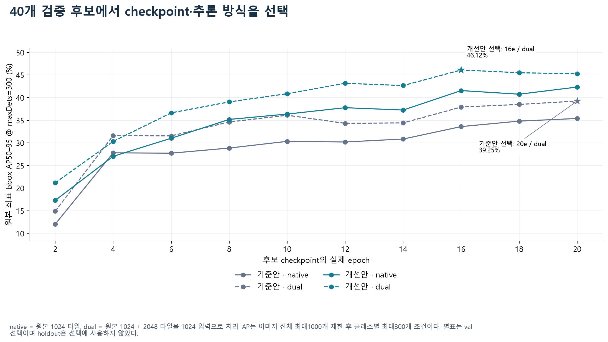
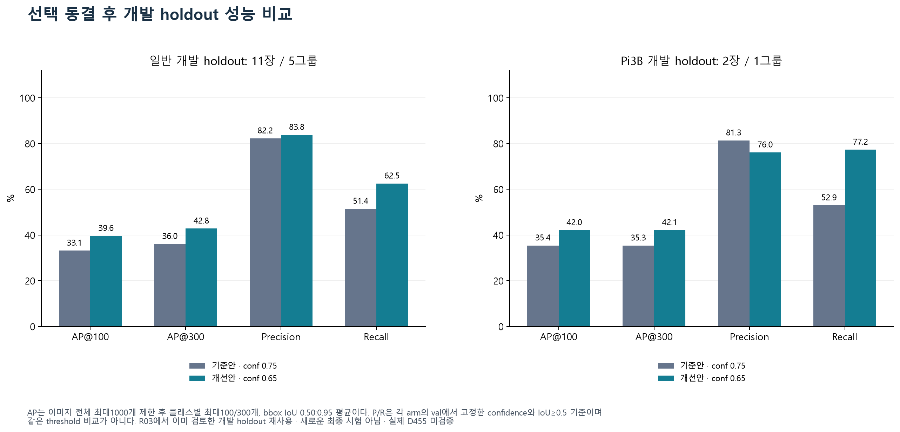
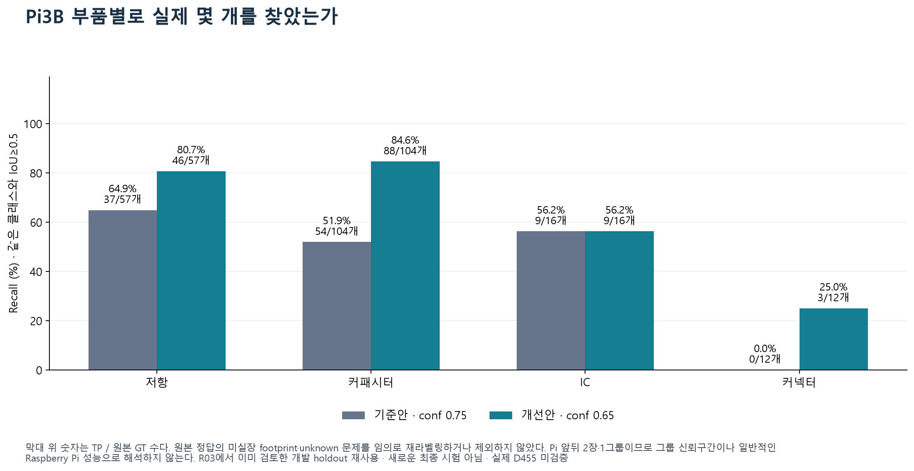
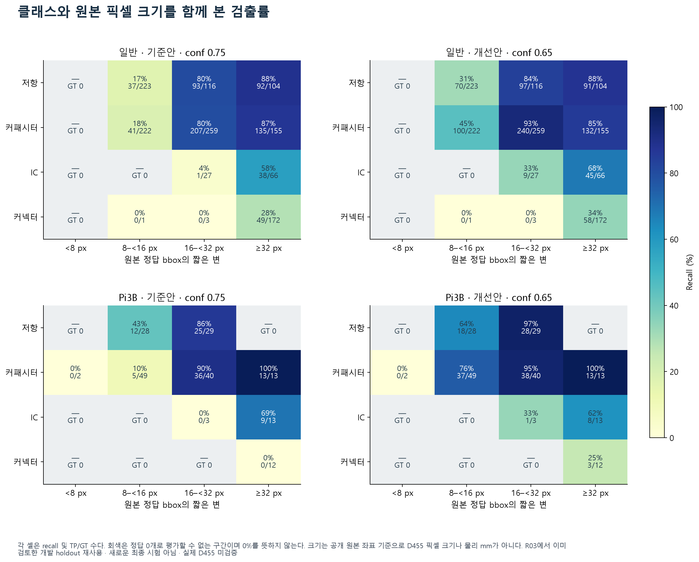
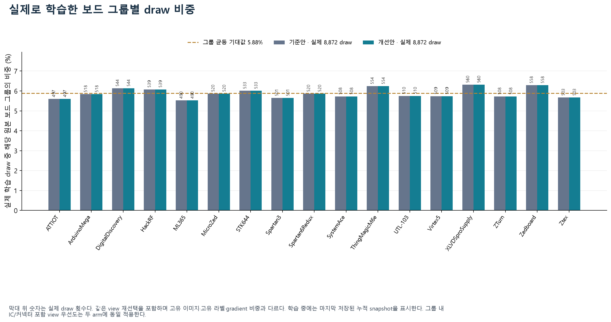

# R04 그래프

생성: 2026-09-28T16:27:31.242426+00:00

기록된 실제 값만 사용했다. 학습 중 그래프는 부분 snapshot이며, 평가가 없는 그래프는 생성하지 않았다. 공개자료 개발 holdout은 R03에서 이미 검토한 자료이고 실제 D455 성능 또는 새로운 최종 시험이 아니다.

## 생성된 그림

### R04 알고리즘과 검증 순서

구조도는 protocol과 데이터 준비 기록을 표현한다. 후보 40개는 사전 계획 수이며 실제 완료 여부는 05 그림과 inventory에서 확인한다. R03에서 이미 검토한 개발 holdout 재사용 · 새로운 최종 시험 아님 · 실제 D455 미검증

[SVG 벡터 파일](01_algorithm_pipeline.svg)

### 고유 원본 라벨과 view 라벨 노출을 구분

우측은 생성된 view를 각각 한 번 세었을 때의 라벨 총합이다. 실제 weighted draw 노출·새 라벨·gradient 비중과 다르다. 새 인간 라벨 및 instance mask는 0개. R03에서 이미 검토한 개발 holdout 재사용 · 새로운 최종 시험 아님 · 실제 D455 미검증

[SVG 벡터 파일](02_original_labels_and_view_exposures.svg)

### 완전한 부품 모습 확보와 학습 ignore 범위

확보율은 저장 view 기하 기준이며 sampler가 실제로 모든 객체를 뽑았다는 뜻은 아니다. ignore는 학습의 음성 분류 loss만 제외한다. 알려진 비대상은 배경 유지, 평가 GT에는 ignore를 추가하지 않았다.

[SVG 벡터 파일](03_complete_views_and_ignore_regions.svg)

### 실제 학습 기록: loss·가중치 갱신·학습률

저장된 epoch만 표시한다. 별표는 budget으로 중단된 부분 epoch다. 전체 이미지 축소 val은 checkpoint 최종 선택 기준이 아니며, 최종 선택은 별도 native/dual val이다. loss 수치 차이만으로 정확도 우열을 판단하지 않는다.

[SVG 벡터 파일](04_actual_training_loss_and_updates.svg)

### 40개 검증 후보에서 checkpoint·추론 방식을 선택

native = 원본 1024 타일, dual = 원본 1024 + 2048 타일을 1024 입력으로 처리. AP는 이미지 전체 최대1000개 제한 후 클래스별 최대300개 조건이다. 별표는 val 선택이며 holdout은 선택에 사용하지 않았다.

[SVG 벡터 파일](05_all_validation_candidates_ap300.svg)

### 선택 동결 후 개발 holdout 성능 비교

AP는 이미지 전체 최대1000개 제한 후 클래스별 최대100/300개, bbox IoU 0.50:0.95 평균이다. P/R은 각 arm의 val에서 고정한 confidence와 IoU≥0.5 기준이며 같은 threshold 비교가 아니다. R03에서 이미 검토한 개발 holdout 재사용 · 새로운 최종 시험 아님 · 실제 D455 미검증

[SVG 벡터 파일](06_development_holdout_metrics.svg)

### Pi3B 부품별로 실제 몇 개를 찾았는가

막대 위 숫자는 TP / 원본 GT 수다. 원본 정답의 미실장 footprint·unknown 문제를 임의로 재라벨링하거나 제외하지 않았다. Pi 앞뒤 2장·1그룹이므로 그룹 신뢰구간이나 일반적인 Raspberry Pi 성능으로 해석하지 않는다. R03에서 이미 검토한 개발 holdout 재사용 · 새로운 최종 시험 아님 · 실제 D455 미검증

[SVG 벡터 파일](07_pi_class_recall_and_counts.svg)

### 클래스와 원본 픽셀 크기를 함께 본 검출률

각 셀은 recall 및 TP/GT 수다. 회색은 정답 0개로 평가할 수 없는 구간이며 0%를 뜻하지 않는다. 크기는 공개 원본 좌표 기준으로 D455 픽셀 크기나 물리 mm가 아니다. R03에서 이미 검토한 개발 holdout 재사용 · 새로운 최종 시험 아님 · 실제 D455 미검증

[SVG 벡터 파일](08_class_by_native_size_recall.svg)

### 실제로 학습한 보드 그룹별 draw 비중

막대 위 숫자는 실제 draw 횟수다. 같은 view 재선택을 포함하며 고유 이미지·고유 라벨·gradient 비중과 다르다. 학습 중에는 마지막 저장된 누적 snapshot을 표시한다. 그룹 내 IC/커넥터 포함 view 우선도는 두 arm에 동일 적용한다.

[SVG 벡터 파일](09_actual_group_sampling_balance.svg)

각 입력과 결과 파일의 SHA-256, 실제 plotted_values는 [figure_inventory.json](figure_inventory.json)에 기록했다.
