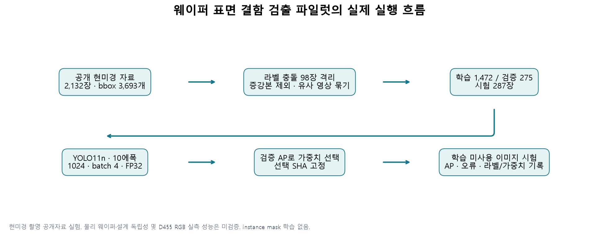
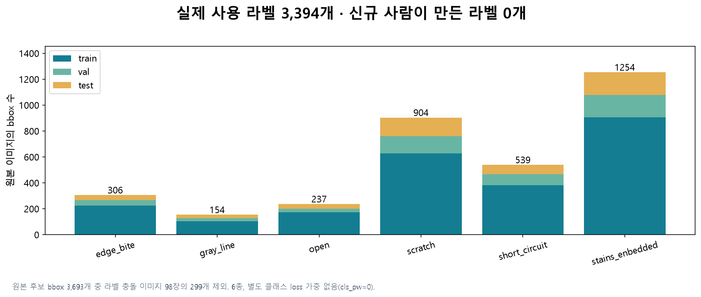
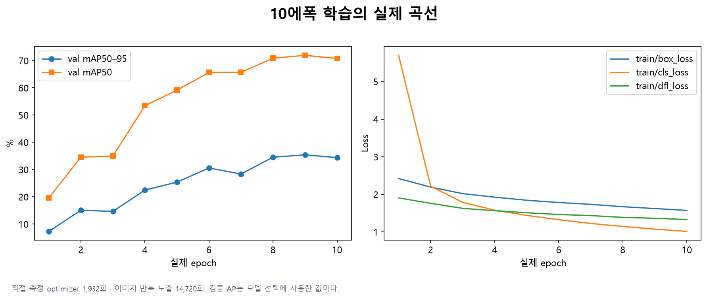
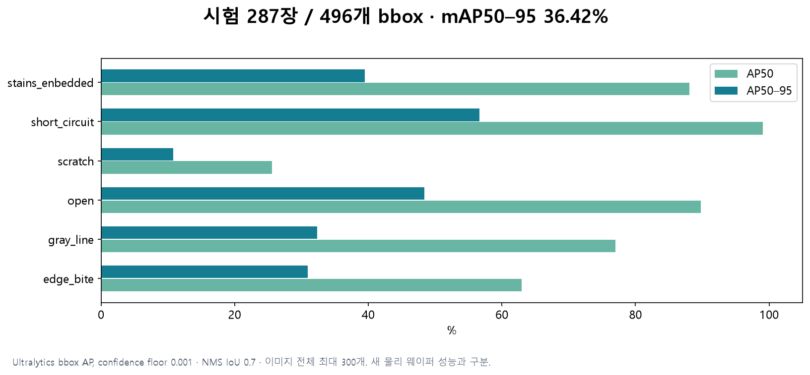

# 웨이퍼 표면 결함 검출 R01 · 실제 학습 결과

2026-09-29. **YOLO11n 10에폭 학습과 학습 미사용 이미지 287장 평가 완료.** bbox mAP50 **73.73%**, mAP50–95 **36.42%**다. 현미경 공개자료의 첫 기준 모델이며 D455 실물 성능이나 생산 검사 합격을 뜻하지 않는다.

## 무엇을 학습했는가

[Wafer-Datas](https://github.com/ztao3243/Wafer-Datas)의 [원저자 공개 선언](https://fcds.cs.put.poznan.pl/FCDS/ArticleDetails.aspx?articleId=521)을 확인하고 commit `17dbc7e19f4e354f9b2b436af66e5abdaf2ea4b1`에서 파일을 받았다. [논문 §3.1](https://reference-global.com/pdf/10.2478/fcds-2024-0014)은 촬영을 electron microscopy와 부착 카메라로 설명한다. 일반 RGB 촬영 자료로 단정하지 않는다.

증강 접미사가 없는 원본 후보 2,132장과 bbox 3,693개를 확보했다. 같은 픽셀에 서로 다른 정답이 붙은 49쌍·98장을 격리해 2,034장·bbox 3,394개를 사용했다. 원본은 그대로 보존했다. source의 `Short_circuit`/`short_cricuit`를 `short_circuit`으로 명시적으로 통합했다. 신규 사람이 만든 라벨과 실제 instance mask는 각각0개다.

| 분할 | 이미지 | bbox |
|---|---:|---:|
| train | 1472 | 2418 |
| val | 275 | 480 |
| test | 287 | 496 |

완전 중복, 명시적인 파일명 계열, pHash≤4의 유사 외관 후보를 같은 split으로 묶었다. **물리 웨이퍼·lot ID가 없으므로 새로운 물리 웨이퍼나 새로운 설계의 성능은 검증하지 못했다.** 남은 라벨 전체를 전문가가 재검수한 것도 아니다.

사용한 2,034장은 모두 결함 라벨이 있는 사진이다. 정상 웨이퍼만으로 구성한 별도 음성 시험셋이 없으므로 정상 제품의 오경보율은 아직 검증하지 않았다.

## 모델과 설정

- 공식 COCO 초기 `yolo11n.pt` → 6종 bbox 검출, 2,591,010 parameters.
- 1024 입력, batch4, nbs8, AdamW lr0=0.001/lrf=0.01, FP32, seed42, 최대10에폭.
- mosaic/mixup/임의 crop/scale 없음. 좌우·상하 반전과 밝기 변화만 사용.
- box/cls/DFL 손실 계수 7.5/0.5/1.5, 추가 class multiplier 없음(cls_pw=0). 이미지별 균등 shuffle이며 class oversampling은 하지 않았다.
- 실제 optimizer 호출 **1,932회**, 이미지 반복 노출 **14,720회**. 가중치 변경·EMA·실제 처리 수를 기록했다.
- 검증 AP50–95 기준 best 선택(기록에서 재구성한 epoch 9), 가중치 SHA 고정 후 시험 실행. 시험 결과로 재선택하지 않았다.

## 시험 결과

| 결함 종류 | AP50 | AP50–95 |
|---|---:|---:|
| edge_bite | 62.95% | 30.93% |
| gray_line | 76.97% | 32.35% |
| open | 89.80% | 48.36% |
| scratch | 25.56% | 10.78% |
| short_circuit | 99.08% | 56.61% |
| stains_enbedded | 88.05% | 39.51% |

Ultralytics8.4.120 bbox AP, confidence floor0.001, NMS IoU0.7, 이미지 전체 최대300개 조건이다. PCB의 COCO maxDets 지표와 서로 다른 데이터·구현이므로 직접 우열 비교하지 않는다. 라이브러리 기본 P/R은 시험셋 F1 최적점이므로 실사용 운용점 결과로 사용하지 않았다. 별도 보조 분석이 있으면 고정 confidence0.25라는 조건을 명시한다.

시험 전에 정한 confidence 0.25 / IoU 0.5에서 **정답 496개 중 380개 검출**, FP 284개, FN 116개였다. Precision 57.23%, Recall 76.61%다. 이 수치는 저장 예측의 점수순 일대일 매칭으로 계산한 설명용 운용점이며 현장에 맞춰 최적화한 임곗값은 아니다.

## 그래프와 기록

[훈련 기록](reports/training_summary.json) · [독립 데이터 감사](reports/independent_data_audit.json) · [결과 감사](reports/independent_final_results_audit.json) · [시험 지표](reports/test_metrics.json) · [전체 후보 조사](research/research.md).

## 사용하는 법과 다음 단계

`models/best.pt`는 이6종의 현미경 표면 결함 bbox 모델이다. Python 환경에서 `YOLO('models/best.pt').predict(source='image.jpg',imgsz=1024,conf=0.25)`로 시험할 수 있다. confidence0.25는 현장 보정된 값이 아니다. D455 입력·노출·초점·최소 결함 픽셀 수와 실물 정답으로 재검증해야 한다.

실제 segmentation은 [Roboflow Wafer Defect v2](https://universe.roboflow.com/wafer-irhuv/wafer-defect-rv1vx/dataset/2)의 4,532장·7종 polygon 자료가 후속 후보이나 정식 export 로그인이 필요하다. 이번 bbox를 mask 정답으로 바꾸지 않았다.

자료는 연구용으로 공개됐지만 별도 데이터 라이선스는 명시되지 않았다. 원본 사진·원본/변환 라벨·원본 bbox 좌표·학습/예측 사진 grid는 이 패키지에 넣지 않았다. 로컬 원본 위치는 `work/wafer_r01/raw`, 준비된 데이터는 `work/wafer_r01/data`다. 패키지에는 모델·코드·수량·해시·곡선과 실행 기록이 포함된다.
