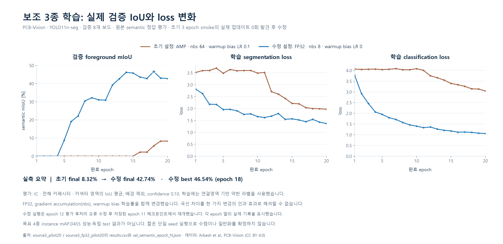
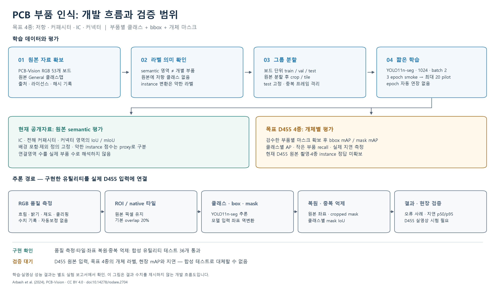
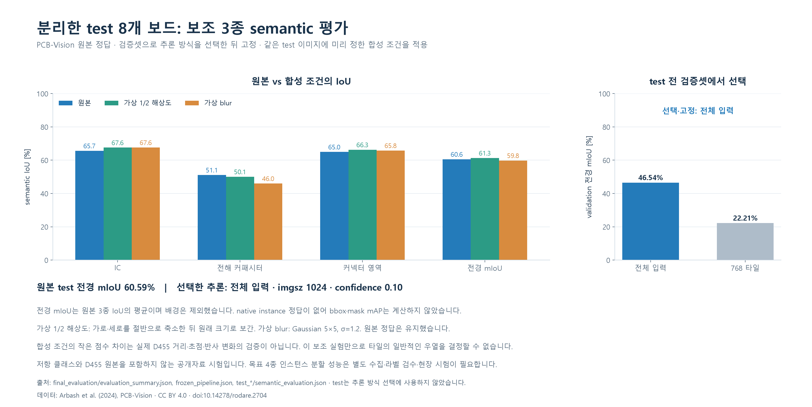
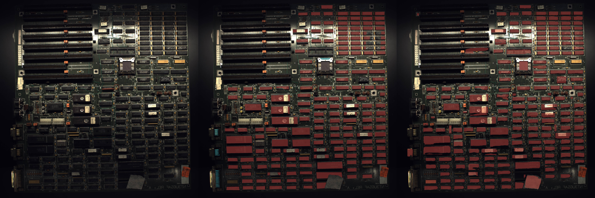

# PCB 부품 세그멘테이션 R02 — 실제 학습·시험 결과

2026-09-28 · RTX 5060 Laptop 8GB · 상태: **공개 데이터 보조 실험 완료 / 목표 4종 D455 실사용 평가 전**

**3에폭은 실행 점검용으로 쓰고, 첫 성능 판단은 최대 20에폭으로 진행하는 것이 현재 결과에 맞다.** 공개 에셋을 확보해 실제 학습과 독립 시험을 마쳤다. 다만 확보한 정답은 IC·전해콘덴서·커넥터 영역 3종의 semantic mask이므로, 사용자가 원하는 저항·커패시터·IC·커넥터 4종의 instance mAP와 구분한다.

## 1. 이번에 실제로 한 일

| 항목 | 결과 |
|---|---|
| 공개 에셋 | PCB-Vision 원본 RGB 53장과 General semantic mask 53장 확보, 출처·라이선스·해시 기록 |
| 학습 | 공식 YOLO11n-seg 사전학습 가중치에서 보조 3종으로 파인튜닝; 수정한 본 실험 총 20에폭 |
| 분할 | 저자 보드 ID 기준 train 37 / val 8 / test 8. 이미지 해시와 그룹 중복 검사 |
| 학습 정답 | train 1,584개 연결영역 polygon. 원본 semantic map에서 만든 **약한 라벨** |
| 평가 정답 | 변형하지 않은 원본 semantic mask. CC를 실제 instance 정답으로 간주하지 않음 |
| 독립 시험 | 원본 시험 foreground mIoU **60.59%**, IC 65.66%, 전해콘덴서 51.13%, 커넥터 영역 64.98% |
| 코드 검증 | 좌표 복원·타일·마스크 중복 처리·화질 통계·데이터 누수·semantic 평가 등 **64개 검사 통과** |
| D455 | SDK와 Windows 장치 목록에서 현재 장치 0대. 촬영을 시작하지 않았으며 실물 성능 미검증 |
| 미완료 | 실제 D455 4종 라벨, 4종 학습, bbox/mask mAP, 실제 카메라 지연·프레임 안정성 |

출처: [PCB-Vision 원기관 데이터](https://zenodo.org/records/10617721), [논문](https://arxiv.org/html/2401.06528), [저자 코드](https://github.com/hifexplo/PCBVision). Arbash et al. (2024), DOI 10.14278/rodare.2704, 데이터 CC BY 4.0. 원본 mask는 보존했고 학습용 축소·연결영역 polygon만 파생했다.

FPIC는 원기관 접근 절차가 필요해 이번 자동 확보에 포함하지 않았다. 기존 GitHub 모델은 보드 전체 검출 또는 다른 클래스용이라 목표 4종 segmentation 가중치로 바꾸어 사용하지 않았다. 기존 저장소와 가중치는 그대로 보존했다.

## 2. 3에폭으로 충분한가

일반적으로 에폭 수만으로 충분성을 정할 수 없다. 데이터 수·사전학습·실제 가중치 갱신 횟수·검증 성능을 같이 봐야 한다. 이번 작은 데이터 실험에서는 수정한 3에폭 실행도 foreground mIoU가 0이어서 실사용 판단 근거가 되지 않았다.

| 실행 | 예산 | 실제 optimizer 갱신 | 마지막 val foreground mIoU | 판단 |
|---|---:|---:|---:|---|
| 최초 AMP 점검 | 3 epochs | 0회 | 0.00% | loss와 파일 생성만으로 정상 학습이라 판단하면 안 됨 |
| 최초 AMP 파일럿 | 20 epochs | 6회 | 8.32% | 작은 데이터·누적 배치 및 AMP skipped step 문제 확인 |
| FP32 재점검 | 3 epochs | 23회 | 0.00% | 가중치 갱신은 정상, 성능은 부족 |
| 수정 FP32 파일럿 | 20 epochs | 104회 | 42.74% | 최고 val은 epoch 18의 46.54%; 이 체크포인트 선택 |

최초 실행에서는 finite loss가 나왔지만 GradScaler가 갱신을 건너뛰었고, nbs 64와 batch 2의 큰 누적 배치도 짧은 실험에서 갱신 기회를 줄였다. FP32, nbs 8, warmup bias LR 0으로 바꿨다. 이는 **이 실행에서 관측한 문제**이며 RTX 5060이나 AMP 전체가 동작하지 않는다는 결론이 아니다.

FP32 3에폭 점검은 warmup bias LR 0.1이었고, 수정 본 실험은 0.0이었다. 여러 설정을 함께 바꿨으므로 그래프 차이를 특정 한 설정의 효과로 분리해 주장하지 않는다. 본 실험은 epoch 12의 빈 예측 윤곽 평가 오류를 수정하고, 저장된 epoch 11에서 남은 9에폭을 이어 총 20에폭을 완료했다. 재시작 전 실패한 epoch 12의 일부 계산 비용은 별도로 발생했다.

최종 run의 104회와 선택된 epoch 18 모델의 95회를 구분해 기록했다. 선택 모델은 저장된 epoch 18 가중치와 561개 state tensor가 모두 일치하는 것도 확인했다. 초기 실패 실험은 증거를 보존했으며 배포 모델로 선택하지 않았다.

## 3. 이번 최종 설정

| 설정 | 값 |
|---|---|
| 기반 모델 | YOLO11n-seg, 공식 사전학습 가중치 |
| 학습 입력 / batch | 1024 / 2 |
| 정밀도 / nominal batch | FP32 / nbs 8; 정상 구간 누적 약 4 batches |
| optimizer | AdamW, lr0 0.001, lrf 0.01, weight decay 0.0005 |
| warmup | 2 epochs, bias LR 0.0 |
| 예산 | 보조 실험 20 epochs 고정; 실제 target4 runner는 최대 20, patience 7 |
| 마스크 | mask_ratio 4, overlap_mask True; 추론 retina_masks False |
| 증강 | 회전 ±15°, 이동 0.05, scale 0.2, 약한 HSV; mosaic·mixup·copy-paste·flip 0 |
| 환경 | Python 3.11.9, torch 2.12.1+cu130, ultralytics 8.4.120 |
| 메모리 | 재개 프로세스 CUDA 최대 allocated 약 **4.79 GiB**. 전체 시스템 VRAM 점유와는 다른 측정값 |
| 재현 기록 | seed 42, deterministic True, workers 0, checkpoint·manifest SHA256, split 및 환경 JSON |
| 선택 모델 | `models/pcbvision_source3_fp32_best.pt`, epoch 18 |

best SHA256: `85eb1ac6dbac87ffb04424f37730617d6a0e47be51124e7d9b95cc06882c8fc1`.

## 4. 알고리즘과 낮은 화질 대응

구현한 경로는 원본 영상 → 고정 ROI 또는 전체 영상/타일 → segmentation → 원본 좌표 복원 → mask IoU 중복 제거 → overlay·JSON 저장이다. 흐림 정도, 밝기, 검정/밝은 픽셀 비율도 함께 기록한다. 화질 통계는 관측 지표이며 자동 품질 합격 판정이 아니다.

**타일을 무조건 켜지 않는다.** 이번 공개 검증 8장에서는 전체 영상 46.54%, 768px 타일·20% 겹침 22.21%로 전체 영상이 더 좋았다. 이 결과로 전체 영상을 선택하고 나서 test를 열었다. 학습 때 본 크기·맥락과 타일 추론의 차이가 가능한 설명이지만 원인 분리 실험은 하지 않았다.

공개 semantic 평가에서는 클래스별 polygon을 원본 좌표에 복원하고 최고 confidence 영역이 픽셀을 차지한다. `infer.py`의 개별 마스크 IoU 중복 제거와는 집계 방식이 다르므로, 아래 점수는 **semantic 평가 파이프라인**에만 붙인다. 타일 경계에서 잘린 부품을 완벽하게 합치는 알고리즘은 아니다.

카메라별 준비는 다음 순서다.

1. D455 원본 30장을 먼저 촬영한다. 최소 부품의 짧은 변 픽셀 수, 흔들림, 반사, 초점, 조명을 확인한다.
2. 고정 지그·확산 조명·PCB가 차지하는 화면 면적부터 조정한다. 원본에 없는 윤곽은 ROI나 타일이 복원하지 못한다.
3. 전체 입력 축소가 문제인 경우에만 ROI/타일을 비교한다. 실제 D455 val에서 정하고 test에는 같은 설정을 사용한다.
4. 촬영 품질에 맞춘 blur·밝기·노이즈 증강은 train에만 추가한다. 실제 원본을 보고 강도를 정한다.
5. RGB 인식을 먼저 검증한다. Depth는 이후 위치·거리 확장 단계에서 RGB 정렬과 유효 깊이를 따로 확인한다.

8px 미만이면 촬영 개선을 우선하고 12~16px 이상을 목표로 하는 기준은 실무 가설이다. 공식 성능 보장선이나 이번 실험으로 확인한 D455 한계가 아니다.

## 5. 독립 시험과 그래프

전체 영상, imgsz 1024, confidence 0.10, 동일 checkpoint를 고정했다. 테스트는 저자 보드 ID 기준 8장이다. foreground mIoU는 3개 foreground class IoU의 평균이며 배경은 제외한다.

| 조건 | foreground mIoU | IC IoU | 전해콘덴서 IoU | 커넥터 영역 IoU |
|---|---:|---:|---:|---:|
| 원본 test | **60.59%** | 65.66% | 51.13% | 64.98% |
| 가로·세로 1/2 축소 후 원래 크기로 보간 | 61.31% | 67.56% | 50.09% | 66.30% |
| Gaussian blur 5×5, σ=1.2 | 59.82% | 67.62% | 46.01% | 65.82% |

해상도·blur 조건은 **합성 열화 시험**이다. 저하량이 작거나 일부 점수가 오른다고 D455에 강하다는 결론을 내릴 수 없다. 작은 시험셋, 입력 자체의 resize, 보드 구성 영향을 받는다. val보다 test 점수가 높은 것도 같은 이유로 보수적으로 해석한다. 반복 seed나 신뢰구간은 이번 짧은 실험에서 측정하지 않았다.

위 영상은 왼쪽 원본, 가운데 원본 semantic 정답, 오른쪽 실제 예측이다. 완전히 맞은 결과가 아니며 누락·범위 오류가 남는다. 이미지와 정답: PCB-Vision, CC BY 4.0; overlay와 예측은 이번 작업의 파생물이다.

공개 원본 test의 prediction 호출 평균은 약 48ms였지만 8장뿐이고 warmup을 엄밀히 분리한 성능 벤치마크가 아니다. 카메라 취득·표시·전체 처리 FPS 또는 실시간 성능으로 환산하지 않는다.

## 6. 목표 4종 라벨 및 mAP 실행 순서

| 단계 | 수량·작업 | 완료 판단 |
|---|---|---|
| 촬영 점검 | D455 원본 30장, 여러 보드·거리·조명 | 저항/커패시터 구분 가능 여부와 작은 윤곽의 픽셀 수 확인 |
| 라벨 규칙 확정 | 초기 30장 전수 검수 | resistor / capacitor / ic / connector, 부품 하나당 mask 하나, 몸체·핀 경계 규칙 고정 |
| 첫 데이터 | 총 200장부터; 기존 30장 포함 | train 클래스별 300~500 instance를 시작 목표, val/test 각 class 50개 이상 목표 |
| 독립 분할 | 보드 기준 약 70/15/15 | 동일 실물·연속 프레임·crop 누수 없음. 새 설계 일반화는 설계 ID로도 분리 |
| 학습 | 3에폭 점검 후 새 pretrained에서 최대 20 | 실제 update, loss, val bbox/mask mAP, 경계 예시 확인 |
| 최종 test | val에서 선택·설정 고정 후 1회 | bbox와 mask 각각 mAP50, mAP50-95, class별 AP, PR/혼동·실패 예시 |

200장은 수집 예산 시작점이며 충분성을 보장하지 않는다. 반복 촬영으로 같은 부품 수만 늘리지 않는다. 원본 COCO instance polygon/RLE를 보존하고 YOLO 학습 라벨로 변환한다. SAM은 라벨 초안을 만드는 보조 수단이며 검수가 필요하다. SAM 자산 설치·실행은 이번 단계에서 하지 않았다.

이번 source3 모델에는 저항 감독 신호가 없고 capacitor도 전해콘덴서만 포함한다. 따라서 실제 target4 학습은 공식 pretrained를 기준으로 시작한다. source3 가중치를 전이 후보로 비교할 수는 있지만 저항 학습 완료로 간주하지 않는다. 두 클래스 ID 순서는 별도라 직접 합치면 안 된다.

`evaluate_instances.py`는 검수된 instance 라벨과 그룹 분할을 검사하고 bbox/mask mAP를 계산하도록 준비했다. 실제 4종 데이터가 없어 아직 실행하지 않았다. evaluator의 max_det=300은 명시적으로 기록하며 COCO AP@100과 혼동하지 않는다. 테스트 점수를 본 뒤 수정했다면 그 결과는 개발 근거로 전환하고 새 독립 시험셋을 확보한다.

## 7. 인계 파일과 현재 한계

- [실행 방법·코드 패키지](PCB_D455_R02/README.md): 학습·추론·촬영·평가 명령, 원본 에셋, 2개 모델, 설정·검사·출처.
- [고정된 평가 설정](PCB_D455_R02/reports/final_evaluation/frozen_pipeline.json): test 전 선택한 설정과 해시.
- [평가 원자료](PCB_D455_R02/reports/final_evaluation/evaluation_summary.json): 실제 class IoU 및 측정 범위.
- [초기 상세 계획 R01](PCB_부품검출_세그멘테이션_계획_R01_Claude검토용.md): 데이터·라벨·mAP 설계. **R02에서 실제 설정은 AMP→FP32, nbs 8로 수정했다.**

코드와 공개 데이터에서 실행되는 보조 모델까지 확보했다. **현재 4종 D455 제품용 모델이 완성된 상태는 아니다.** 실제 카메라 영상과 검수된 target4 mask가 다음 필수 입력이다. D455의 현재 화질·물리 배치·촬영 대상은 아직 확인하지 못했다.
