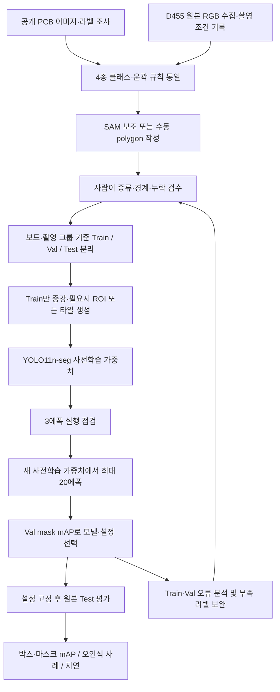
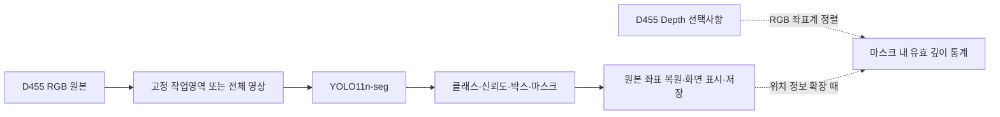

# PCB 부품 검출·인스턴스 세그멘테이션 계획 R01

작성일: 2026-09-27 · 상태: **클로드 검토용 계획안 / 설치·촬영·라벨링·학습·mAP 측정 전**

## 1. 목표와 확정 조건

Intel RealSense D455로 촬영한 PCB에서 **저항·커패시터·IC·커넥터를 개별 부품 단위로 구분하고, 위치 박스와 윤곽 마스크를 함께 출력**한다. 기존의 보드 전체 검출에서 부품 단위 인식으로 범위를 좁히는 작업이다. 검출만으로도 작은 부품을 찾을 수 있지만, 윤곽을 얻으려면 인스턴스 세그멘테이션 학습이 필요하다.

- 사용자 확정: 4종 부품 검출·윤곽 분할, 기존 라벨 우선 활용, 부족하면 신규 제작, 학습·평가 조건 기록, 알고리즘 구성도와 그래프 포함.
- 사용자 확정: RTX 5060 Laptop / VRAM 8GB, 100에폭 대신 평가 가능한 짧은 실험.
- 현재 PC 조회: RTX 5060 Laptop GPU, VRAM 8,151MiB, 드라이버 610.88, RAM 약 15.1GiB. 실제 학습 VRAM·속도는 미측정.
- 후속 지시: **전체 구조를 먼저 클로드에게 검토받기 위해 계획부터 제시. 이번 단계에서는 설치·학습을 실행하지 않는다.**
- 이번 1차 범위는 부품 종류다. 부품 품번/OCR, 누락·납땜 불량 판정, 로봇 조작은 후속 과제로 둔다.

## 2. 기존 GitHub 자료와 이번 목표의 차이

2026-09-27 원격 main 읽기 점검 기준이다. 저장소 밖의 모든 데이터가 없다는 뜻은 아니다.

| 자료 | 확인한 상태 | 이번 계획에서의 활용 |
|---|---|---|
| [mcu-vision](https://github.com/hkjung1011/mcu-vision), main `9c5e7305` | YOLO11m·YOLOX-S 기반 보드 검출 실험. `raspberry_pi_sbc` 1종 bbox가 중심이며, 실제 SMD 자료는 준비가 확인되지 않음 | 기존 입출력·검출 파이프라인 및 실험 기록 구조 참고. 보드 검출 성능을 4종 부품 성능으로 바꾸어 쓰지 않음 |
| [small-component-defect-dataset](https://github.com/hkjung1011/small-component-defect-dataset), main `00c0c8f` | 마스크가 포함된 합성 결함·상태 데이터. 단일 기반 영상의 변형이며 TRAIN_ONLY 용도. 목표 4종의 실제 윤곽 정답과 다름 | 형식 변환·시각화 점검 및 선택적 학습 보조 후보. 실제 D455 test 정답으로 사용하지 않음 |

따라서 기존 코드 재사용과 목표 라벨 확보를 별도로 진행한다. 현재 확인한 두 저장소만으로 바로 4종 실제 부품 segmentation mAP를 측정할 준비가 됐다고 판단할 수 없다.

기존 SMD 계약의 ID는 `capacitor / resistor / diode / transistor / stm32_dev_board / stm32_bare_ic` 순서다. 이번 계획의 4종 ID와 다르므로 기존 설정을 덮어쓰거나 숫자 ID를 그대로 합치지 않고 별도 class-map과 dataset version을 만든다. 근거: [기존 모델 카드](https://github.com/hkjung1011/mcu-vision/blob/9c5e7305b747e102e008c2da674a472554ea5b9b/docs/model_cards/rpi_phash_v2_paired2_yolo11m.ko.md) · [기존 SMD 클래스 정의](https://github.com/hkjung1011/mcu-vision/blob/9c5e7305b747e102e008c2da674a472554ea5b9b/configs/classes.smd_v1.yaml) · [결함 데이터 라벨 정책](https://github.com/hkjung1011/small-component-defect-dataset/blob/00c0c8f71f5c0f626b0d672deb1d2d21ed37ddfd/docs/LABEL_POLICY.md)

## 3. 전체 알고리즘 구조

### A. 학습·평가 경로

### B. 카메라 추론 경로

첫 실행은 단일 segmentation 모델로 끝낸다. 모델이 클래스·박스·마스크를 함께 내므로 검출기와 분할기를 반드시 각각 학습할 필요는 없다. 기존 보드 검출기는 나중에 자동 ROI를 만드는 데 재사용할 수 있으나, Raspberry Pi용 검출기가 모든 PCB를 찾는다고 가정하지 않는다. [Ultralytics 분할 출력](https://docs.ultralytics.com/tasks/segment)

Depth는 첫 4종 RGB 학습 입력에 섞지 않는다. 거리가 필요한 후속 단계에서 RGB와 정렬해 사용한다. 정렬에는 가림·보간으로 인한 오차가 있으므로 작은 부품의 깊이나 높이 정확도를 별도 검증한다. [RealSense 정렬 예제](https://github.com/realsenseai/librealsense/blob/master/examples/align/rs-align.cpp)

## 4. 모델 선택

| 역할 | 1차 선택 | 이유·후속 조건 |
|---|---|---|
| 학습·배포 기준 모델 | **YOLO11n-seg** 사전학습 가중치 | 기존 YOLO11 계열 코드와 연결하기 쉽고 8GB에서 작은 모델부터 검증 가능. 기존 detect 가중치의 이름만 seg로 바꾸는 방식이 아님 |
| 비교 후보 | YOLO26n-seg 또는 YOLO11s-seg | 첫 결과 후 정확도·속도·호환성 문제를 근거로 하나만 비교. 처음부터 여러 모델을 모두 학습하지 않음 |
| 라벨 보조 | SAM2 또는 라벨링 도구의 SAM 기능 | 박스·점으로 마스크 초안 생성, 클래스와 경계는 사람이 확정 |
| 작은 부품 보완 | ROI 확대 또는 SAHI 타일 추론 | 원본에 세부가 존재하는데 전체 입력 축소 때문에 놓칠 때만 적용 |

YOLO11n-seg 선택은 초기 실험 비용과 기존 코드 연결을 고려한 제안이며 최고 정확도라는 결론이 아니다. COCO 사전학습에 목표 PCB 클래스가 그대로 있는 것도 아니므로 목표 데이터로 파인튜닝해야 한다. [YOLO11](https://docs.ultralytics.com/models/yolo11) · [YOLO26](https://docs.ultralytics.com/models/yolo26) · [SAM2](https://github.com/facebookresearch/sam2) · [SAHI](https://github.com/obss/sahi)

## 5. 학습 전에 확인할 D455 촬영 조건

작은 부품을 못 찾는 원인은 모델·라벨뿐 아니라 촬영 해상도일 수 있다. **세그멘테이션으로 바꾸어도 원본에 없는 세부는 생기지 않는다.**

1. 실제 촬영본 30장을 먼저 확보한다. 가능하면 여러 물리 보드, 밝기, 각도, 거리를 포함한다. USB 연결·지원 프로파일·노출·화이트밸런스·거리·프레임 번호·시간을 기록한다.
2. RGB 1280×800 지원 여부를 실제 장치에서 확인하고 가능한 원본 해상도로 저장한다. 15/30fps 중 지원되는 프로파일을 선택한다. 학습용 정지 샘플은 연속 프레임을 대량 복제하지 않는다.
3. 확산 조명, 고정 지그, 반사·흔들림 감소를 우선한다. 임의로 초근접 배치하지 않고 초점과 유효 Depth를 따로 확인한다.
4. 최소 목표 부품의 **원본 짧은 변 픽셀 수**를 측정한다. 잠정 촬영 판정 기준은 8px 미만이면 개선 우선, 12~16px 이상 확보를 우선 목표로 둔다. 이는 성능 보장 기준이나 카메라 공식 사양이 아니라 파일럿에서 검증할 실무 가설이다.
5. 예시 계산: RGB 가로 시야각 90°, 가로 1280px, 거리 0.6m의 정면 평면을 가정하면 촬영 폭은 약 1,200mm다. 2mm 길이는 약 2.1px에 불과하다. 이 조건에서는 미세 윤곽이나 유사한 R/C 구분이 매우 제한적일 수 있다. 실제 측정은 카메라 intrinsics와 거리·자세를 사용한다.
6. 원본이 부족하면 촬영 거리·작업 영역·조명을 먼저 조정하고, 그래도 구분되지 않을 때 근접용 RGB 촬영계 추가를 검토한다. 추가 장비 구매는 이 30장 검사 전에는 결정하지 않는다.

ROI·타일은 입력 리사이즈로 사라지는 세부를 줄이는 방법이지 광학 해상도를 높이는 방법은 아니다. D455의 RGB 사양과 Depth 최소거리·권장거리는 구분한다. [D400 데이터시트](https://www.realsenseai.com/download/21345/?tmstv=1778232235) · [SDK 투영 모델](https://github.com/realsenseai/librealsense/wiki/Projection-in-RealSense-SDK-2.0)

## 6. 기존 라벨 확보 전략

| 우선순위 | 후보 | 활용 판단 |
|---|---|---|
| 1 | **FPIC** | 원기관 소개 261장·93종 PCB, 부품 윤곽 polygon/CSV와 designator. 텍스트·부품 합계 71,000개 이상이며 전부 부품 마스크라는 뜻은 아님. 이용조건·접근 방식·4종 매핑·원본 보드 ID를 먼저 확인 |
| 2 | **직접 D455 촬영** | 실제 배포 환경의 차이를 줄이는 필수 자료. 공개 데이터가 충분하더라도 D455 검증·시험 자료는 별도 확보 |
| 예비 | PCB-SAID | 논문상 175장·66클래스, bbox+polygon. 요청 시 제공 자료이며 4종으로 안전하게 매핑되는지 확인 필요 |
| 후속 | SolDef_AI | 부품 위치·납땜 불량용 근접 영상. 원본 1,150장 중 라벨 있는 428장의 과업이 나뉘며 현재 4종 학습의 주력 자료로 즉시 채택하지 않음 |

FPIC를 확보하면 먼저 30~50개 라벨 예제로 종류·윤곽·부품 다리 포함 방식과 이용조건을 검토한다. 맞는 polygon은 재사용하고 빠진 클래스·카메라 조건만 새로 라벨링한다. bbox만 있으면 SAM 초안 생성에 사용하되, **사각형을 채운 마스크를 실제 윤곽 정답으로 평가하지 않는다.**

공개 데이터 획득이 지연되면 자체 D455 파일럿을 진행할 수 있게 계획한다. 합성·공개·D455 실촬영 데이터는 출처 필드를 유지하며, 실제 성능을 주장하는 test는 D455 실촬영으로 구성한다.

출처: [FPIC 원기관](https://physicaldb.ece.ufl.edu/index.php/fics-pcb-image-collection-fpic/) · [FPIC 논문](https://arxiv.org/html/2202.08414) · [저자 변환 코드](https://github.com/CandleLabAI/PCBSegClassNet) · [PCB-SAID 논문](https://openaccess.thecvf.com/content/ICCV2025W/VISION%2725/html/Mineo_PCB-SAID_A_Low-Cost_Camera-Based_Dataset_for_Few-Shot_SMD_Assembly_Inspection_ICCVW_2025_paper.html) · [SolDef_AI 논문](https://www.mdpi.com/2504-4494/8/3/117)

첨부 Xu et al., Sensors 2025 그림의 유력 대응 원문은 [DOI 10.3390/s25113550](https://pmc.ncbi.nlm.nih.gov/articles/PMC12158347/)이다. 210장·7부품·정상/불량 19라벨의 bbox 검출 연구이며 데이터는 저자 요청 방식이다. 첨부 그림과 픽셀 수준 일치는 미확정이다. 그림의 CC BY 4.0 표기가 segmentation 정답의 공개를 의미하지 않는다.

## 7. 라벨링 수량과 규칙

### 수량: 30장 점검 → 총 200장으로 첫 평가

| 단계 | 신규 D455 원본 목표 | 목적 |
|---|---:|---|
| 촬영·규칙 점검 | 30장 | 식별 가능성·윤곽 규칙·실제 라벨 시간 확인. 이 자료는 이후 train 쪽에 편입 |
| 첫 학습·평가 | **총 200장** | 앞의 30장 포함. 원본 수이며 crop·증강본을 200장으로 세지 않음 |
| 오류 보완 | 필요시 50~100장씩 | train/val에서 확인한 누락 클래스·빛·각도 조건 중심. 처음부터 대규모 라벨링하지 않음 |

- 200장은 예산 시작점이며 충분한 수량을 보장하지 않는다. 장당 10~30개 부품을 라벨링한다는 가정이면 약 2,000~6,000개 마스크지만 실제 개수는 30장 검사에서 산정한다.
- train에서 **클래스당 300~500개 인스턴스**를 초기 수집 목표로 둔다. 커넥터처럼 적게 나오는 클래스는 해당 부품이 있는 다른 보드를 우선 추가한다.
- val/test는 각 클래스 50개 이상을 우선 목표로 삼되, 독립 보드·실물 부품 수를 함께 기록한다. 반복 촬영한 같은 부품 500개는 서로 다른 부품 500개와 같지 않다.
- 목표 인스턴스 수와 보드 다양성을 200장으로 충족하지 못하면 부족을 기록한다. 임의 복제로 숫자만 채우지 않는다.
- 실제 공수는 `검수 포함 1장 평균 시간 × 추가 장수`로 계산한다. 30장 측정 전에는 작업시간을 확정하지 않는다.

### 클래스·경계

| ID | 이름 | 판단 기준 |
|---:|---|---|
| 0 | resistor | 저항. BOM·designator·확대 원본으로 확인 |
| 1 | capacitor | 커패시터. 색상 하나만으로 저항과 구분하지 않음 |
| 2 | ic | IC 패키지. 트랜지스터·다이오드 등 유사 외형과 혼동 여부 확인 |
| 3 | connector | 커넥터·헤더. 포함할 종류를 예제 이미지로 고정 |

V1 경계안은 **보이는 부품 몸체의 윤곽**이다. 몸체와 연속된 금속 단자는 포함하고, 돌출 리드·납땜·PCB 패드·실크 인쇄는 제외하는 기준을 우선 제안한다. IC/커넥터의 돌출 핀까지 포함해야 한다면 별도 `full_component_v1` 정책으로 변경하고 공개 라벨도 이에 맞춰 재검수한다. 두 정의를 한 학습셋에 섞지 않는다. 이 경계 정의는 클로드 검토 항목이다.

- 부품 한 개당 instance 한 개. 붙어 있는 저항 두 개를 한 마스크로 묶지 않는다.
- 원본 master는 COCO instance polygon/RLE로 보존하고 YOLO segmentation으로 내보낸다. bbox는 검수 마스크에서 산출해 이중 라벨링을 줄인다.
- 대상 4종은 한 이미지 안에서 빠짐없이 라벨링한다. 다른 종류의 부품을 배경으로 둘 수는 있지만, 미확정 대상 부품을 무조건 배경 처리하지 않는다.
- 종류나 경계가 불명확한 이미지는 검수 대기로 분리한다. ignore 처리 지원 없이 어려운 대상만 라벨에서 지우지 않는다.
- 가림은 보이는 영역만 표시하고 occluded 속성 기록. 전체 형태를 상상해서 채우지 않는다.
- SAM 마스크는 초안이다. 사람 검수 후 확정하며 val/test는 전수 검수한다. train은 초반 30장 전수 검수 후, 추가분은 최소 20% 재검수 및 모든 의심 사례 확인을 제안한다.

## 8. 데이터 분할과 누수 방지

기본 비율은 **train 70% / val 15% / test 15%**다. 200장이라면 140/30/30장이 예시지만, 정확한 장수보다 그룹 분리를 우선한다.

- 필수 식별자: `source_dataset`, `board_design_id`, `physical_board_id`, `capture_session_id`, `source_image_id`, `split`.
- 같은 보드의 연속 프레임·회전본·crop·타일을 서로 다른 split에 넣지 않는다. **그룹 분할을 먼저 하고 crop·증강을 나중에 만든다.**
- 새 PCB 설계에 대한 일반화가 목표면 board_design_id 단위로 분리한다. 보드 종류가 적으면 해당 주장은 유보한다.
- 한 보드만 있는 경우에는 별도 촬영 세션 holdout을 할 수 있지만 결과 이름을 ‘동일 보드, 다른 촬영 조건’으로 제한한다. 독립 보드 일반화로 보고하지 않는다.
- 공개 이미지 파생본도 원본 보드 기준으로 묶는다. 원본 관계가 불명확하면 학습에만 사용하고 D455 test로 검증한다.
- 모델·전처리·confidence·타일 설정은 val로 선택하고 test는 최종 평가에만 사용한다.

## 9. 8GB용 짧은 학습 설정 초안

모든 값은 **제안값이며 실행 검증 전**이다. 모델 최적값으로 주장하지 않는다.

| 항목 | 초깃값 |
|---|---|
| 모델 | `yolo11n-seg.pt` |
| 실행 점검 | 3 epochs, 라벨·loss·GPU·체크포인트 생성 확인 |
| 본 파일럿 | **새 pretrained에서 최대 20 epochs**; 점검 3 + 본 20으로 최대 23에폭분 계산 |
| 조기 종료 | patience 7; val 개선이 멈추면 종료 |
| 입력 크기 | imgsz 1024 |
| batch | 2, 메모리 부족이면 1 |
| 정밀도 | AMP 사용 |
| optimizer | AdamW |
| 학습률 | lr0 0.001 / lrf 0.01 |
| weight decay / warmup | 0.0005 / 2 epochs |
| 재현 기록 | seed 42, deterministic True; 완전 동일성은 환경에 따라 검증 |
| RAM·로더 | cache False, Windows workers 0 시작 |
| 마스크 축소 | mask_ratio 4; 작은 마스크 소실이 확인되면 2를 별도 비교 |
| 증강 | rotation ±15°, translate 0.05, scale 0.2, 가벼운 밝기 변화 |
| 초기 제외 | mosaic / mixup / copy-paste / 좌우·상하 반전 |

밝기·색 증강은 종류 구분 특징을 없애지 않는 범위로 제한한다. 실제 운용에서 임의 회전이 있다면 회전 범위를 val과 함께 조정한다. 입력 1280, small 모델, 타일링을 한꺼번에 변경하지 않는다.

3에폭은 정확도 실험이 아니다. 20에폭에서 계속 개선돼도 이번 결과는 ‘짧은 학습 예산의 기준선’으로 보고하며, 자동으로 100에폭까지 늘리지 않는다. 검수 이후 실제 파일럿의 `best.pt` 선택은 val **mask mAP50–95** 기준을 우선한다. 프레임워크 기본 fitness와 다른 경우 epoch별 지표·가중치를 저장해 원하는 기준으로 명시 선택한다.

카메라 실행 환경과 별도 가상환경에서 PyTorch·torchvision·Ultralytics 버전을 고정한다. RTX 50 계열을 지원하는 공식 CUDA wheel 조합을 설치 시점에 확인하고, CUDA tensor 및 모델 forward/backward를 통과해야 환경 준비로 판정한다. 기본 Python 3.11에서 관련 패키지가 조회되지 않았지만 다른 가상환경의 부재를 뜻하지는 않는다. [학습 설정](https://docs.ultralytics.com/usage/cfg) · [PyTorch 설치](https://pytorch.org/get-started/locally/)

## 10. mAP 평가 설계

IoU는 예측과 정답 영역의 `교집합 / 합집합`이다. mAP50은 IoU 0.5, mAP50–95는 IoU 0.50~0.95를 0.05 간격으로 평가한 AP를 클래스 평균한 지표다.

| 필수 결과 | 의미 |
|---|---|
| bbox mAP50 / mAP50–95 | 부품 종류와 위치 박스 정확도 |
| **mask mAP50 / mAP50–95** | 부품별 윤곽 정확도, 1차 핵심 지표 |
| 4종별 AP·Precision·Recall·정답 개수 | 평균에 가려진 커넥터 부족·R/C 혼동·누락 확인 |
| 작은 부품 구간별 Recall | 원본 짧은 변 <8 / 8~16 / ≥16px 구간의 자체 지표; COCO 표준 AP-small과 구분 |
| FP / FN 사례 | 실크 인쇄 오검출·부품 누락·마스크 합쳐짐·반사 문제 |
| 추론시간·전체 지연·VRAM | GPU 추론과 캡처→표시 지연을 구분, p50/p95와 실효 FPS 기록 |

- AP 평가 때 낮은 confidence(예: 0.001)로 PR 범위를 유지한다. 실제 운용 confidence는 val에서 정하고 test 전에 고정한다.
- 동일한 원본 test에 bbox·mask 정답을 사용한다. 기존 Raspberry Pi 보드 점수나 합성 결함 분류 정확도와 직접 비교하지 않는다.
- Ultralytics 지표와 공식 COCO evaluator 설정은 구분해 기록한다. COCO 기본 maxDets=[1,10,100]을 유지한 결과와, 밀집 PCB를 위해 cap을 늘린 결과를 별도로 표시한다. 예측기의 max_det도 별도 기록한다.
- 타일링 비교 시 원본 좌표로 마스크 복원·중복 병합 후 원본 전체에서 평가한다. 타일별 mAP를 전체 영상 mAP처럼 보고하지 않는다.
- 사람이 정확히 잘라 준 ROI 평가는 그 조건을 명시한다. 최종 자동 ROI 시스템은 ROI 검출 실패까지 포함한 전체 흐름을 평가한다.
- 30장 test는 예비 평가다. 클래스별 실물 수·보드 수와 불확실성을 함께 보고하고, 높은 mAP 수치를 사전에 보장하지 않는다.

출처: [Ultralytics bbox/mask 지표](https://docs.ultralytics.com/tasks/segment) · [COCO evaluator](https://github.com/cocodataset/cocoapi/blob/master/PythonAPI/pycocotools/cocoeval.py) · [SAHI](https://github.com/obss/sahi)

## 11. 알고리즘 그림과 그래프 산출물

첨부 예시의 의미처럼 ‘입력 → 처리 → 출력 → 평가’가 연결된 구성도를 만들되, 해당 예시의 로봇·VR 장치를 이 과제에 임의로 추가하지 않는다.

| 산출물 | x / y 또는 구성 | 생성 시점 |
|---|---|---|
| 전체 알고리즘 구성도 | D455 / 데이터·라벨 / 모델 / 결과 / 평가를 색상별 구분, 학습과 추론 경로 구분 | 계획 검토 후 그림 정리 |
| 데이터 분포 막대그래프 | 클래스별 이미지·instance·독립 보드 수; train/val/test 구분 | 라벨 확보 후 |
| 학습 loss 곡선 | epoch / train·val loss, box·seg·cls·DFL 분리 | 실제 학습 후 |
| 학습 mAP 곡선 | epoch / val bbox·mask mAP50–95 | 실제 학습 후 |
| PR 곡선·혼동행렬 | 클래스별 검출 Precision–Recall, 클래스 혼동·배경 FP/FN | 평가 후. mask mAP와 역할 구분 |
| 클래스별 성능 막대그래프 | 4종 / bbox AP·mask AP, 표본 수 표시 | test 평가 후 |
| 예측 전후 비교 | 원본 / 정답 윤곽 / 예측 윤곽 / 실패 사례 | 평가 후 |
| 선택적 비교 | 전체입력 vs ROI·타일의 mask AP와 전체 지연 | 해당 비교 실험을 실제 수행한 뒤 |

그래프에는 dataset version, split, 모델, 실제 epoch, 입력 크기, 측정 환경을 함께 표시한다. 학습 전 예시 곡선이나 예상 mAP를 실측처럼 그리지 않는다. 현재 문서의 알고리즘은 계획도이며 구현 완료를 뜻하지 않는다.

## 12. 실행 순서·기록·완료 기준

| 순서 | 할 일 | 단계 완료 근거 |
|---|---|---|
| 0 — 현재 | 클로드가 구조·데이터·설정·평가 계획 검토 | 수정사항을 반영한 R02 계획 |
| 1 | 기존 공개 라벨 검사 + D455 30장 촬영 | 원본·최소 픽셀·클래스 예시·촬영 조건 |
| 2 | 총 200장 및 4종 mask 확보, 그룹 split | 라벨 검수와 누수 점검, 클래스별 부족량 명시 |
| 3 | 환경 준비·3에폭 실행 점검 | CUDA forward/backward·loss·모델 저장 확인 |
| 4 | 최대 20에폭 파일럿 | epoch별 지표·가중치·실행 설정 |
| 5 | val로 선택, test 평가 | bbox/mask mAP·클래스별 결과·실패 사례·그래프 |
| 6 | 후속 필요성 결정 | 촬영·라벨·ROI·모델 중 개선할 원인을 근거로 선택 |

남길 기록: 원본 출처/권리 조건, 파일 hash, 클래스·윤곽 규칙 버전, 라벨 검수자·수정 이력, 이미지/instance/보드 수, split manifest, 촬영 설정, 코드 commit, 라이브러리 버전, pretrained/checkpoint hash, 전체 학습 인자, epoch별 loss/mAP, val 선택 이유, test 예측과 정답, 지연 측정 조건.

최초 완료 목표는 최고 성능 달성이 아니라 **재현할 수 있는 짧은 학습 1회와 정당한 실제 D455 평가 결과 확보**다. 이 문서를 작성한 현재에는 조사·계획만 완료했으며 모델 학습, 새 라벨, 실측 mAP/FPS는 없다.

## 13. 클로드에게 전달할 검토 요청

아래 계획을 PCB 비전 실험 설계 관점에서 검토해 주세요. 구현·설치·학습은 아직 시작하지 말고, 수정해야 할 항목과 유지할 항목을 근거와 함께 제안해 주세요. 사용자 제약은 D455, RTX 5060 Laptop 8GB, 저항·커패시터·IC·커넥터 4종 instance segmentation, 3에폭 점검 + 최대 20에폭 파일럿입니다.

1. D455의 시야각·촬영 거리·최소 부품 픽셀 수에서 목표가 가능한가? 촬영계 보완을 먼저 해야 하는 조건은 무엇인가?
2. 기존 YOLO11 코드를 고려한 YOLO11n-seg 선택이 적절한가? YOLO26n-seg 비교는 언제 필요한가?
3. FPIC 등 공개 라벨을 재사용할 때 종류·윤곽·원본 보드 분리에서 빠진 점이 있는가?
4. V1을 몸체 윤곽으로 정의할지 돌출 핀까지 포함할지, D455 해상도와 목표에 맞는 라벨 기준은 무엇인가?
5. 200장·클래스당 train 300~500 instances라는 초기 예산, 그룹 split, 짧은 학습 설정의 약점은 무엇인가?
6. bbox/mask mAP, 밀집 장면 cap, 타일 병합, test 누수 방지, 그래프 구성이 공정하고 충분한가?
7. 추가 실험은 필요한 순서대로 제시하고, 측정하지 않은 성능·시간을 확정하지 말아 주세요.

리뷰 결과를 반영해 R02를 만들고 그다음 데이터 준비부터 진행한다.
